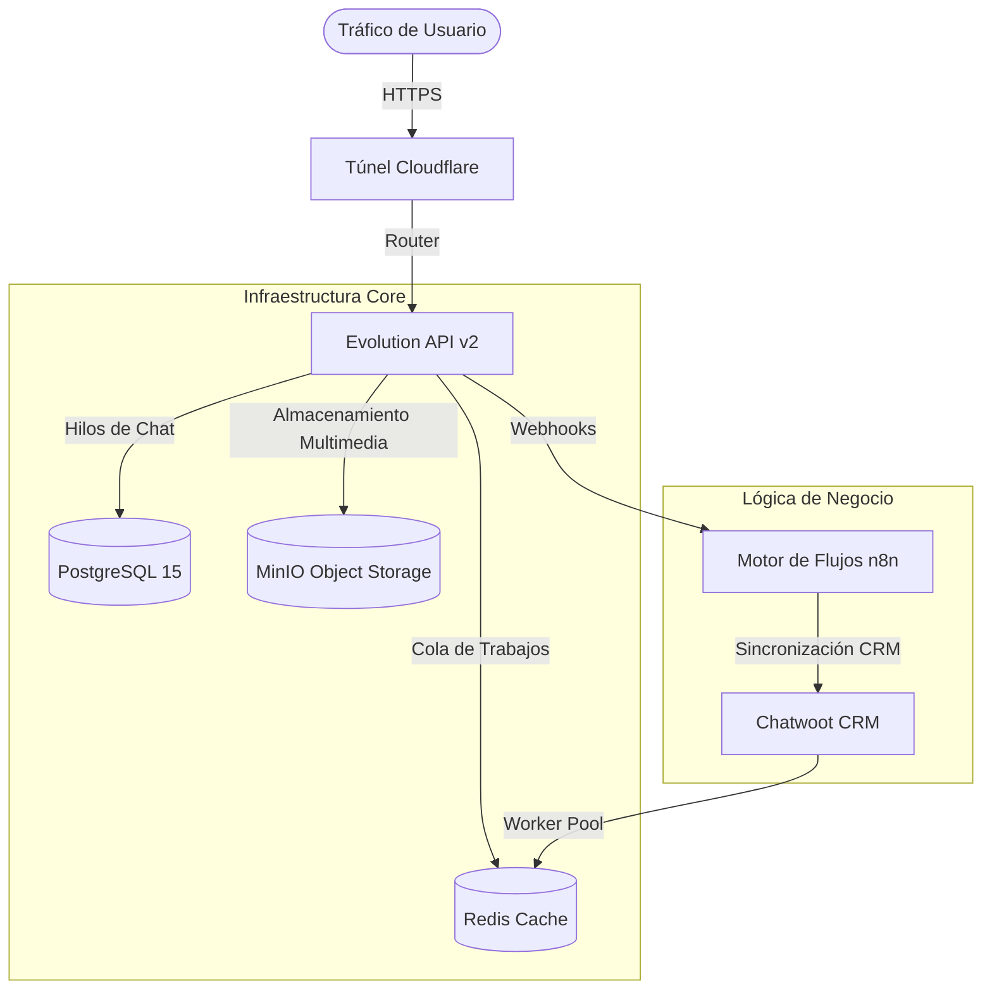

# 🔱 Sentinel OS v11.0: Arquitectura Enterprise

> **"Sencillez Absoluta. Potencia de Precisión. Autoridad Visual."**
> **Estándar:** Arquitectura Empresarial | Escalabilidad | Fiabilidad

---

## 🏗️ Arquitectura del Sistema

Sentinel OS v11.0 ofrece un entorno robusto y contenerizado para la orquestación de flujos de chatbot complejos. Se basa en una pila probada de microservicios diseñados para alta concurrencia e integridad de datos.

### 🧩 Diagrama de Componentes


---

## 🚀 Características Clave

| Característica | Descripción | Métrica de Rendimiento |
| :--- | :--- | :--- |
| **Alta Concurrencia** | Pooling de Conexiones Optimizado (PgBouncer) | Soporta 500+ conexiones activas |
| **Almacenamiento S3 Soberano** | Object Storage auto-hospedado vía MinIO | Cero restricciones en tamaño de archivos |
| **Balanceo de Carga** | Tuning de Sidekiq Workers | 50 Hilos Concurrentes para Chatwoot |
| **Monitoreo Inteligente** | Hub de Recursos en Tiempo Real | Rastreo de Latencia sub-10ms |
| **Seguridad Primero** | Gestión de Credenciales tipo Bóveda | Visualización encriptada |

---

## 🛠️ Guía de Uso

### 1. El Centro de Control (Sistema Maestro)
El sistema se gestiona a través de la terminal interactiva `sistema_maestro.sh`.
```bash
./sistema_maestro.sh
```

### 2. Opciones del Menú Principal
- **1. Iniciar/Reiniciar:** Inicia la secuencia de arranque completa con auto-diagnóstico.
- **3. Monitor de Recursos:** Dashboard en tiempo real de uso de CPU/RAM de todos los contenedores.
- **4. Auditor de Logs:** Streaming en vivo de logs para depurar el flujo de la aplicación.
- **5. Bóveda del Sistema:** Visualiza de forma segura todas las API Keys, Contraseñas y Puntos de Acceso.

---

## 📦 Instalación y Despliegue

### Prerrequisitos
- Docker & Docker Compose
- Python 3.9+
- Git

### Inicio Rápido
1. **Clonar Repositorio:**
   ```bash
   git clone <repo_url>
   cd chatbot-stack
   ```
2. **Configuración de Entorno:**
   Asegúrate de que el archivo `.env` esté poblado con credenciales válidas (ver `env.example`).
3. **Lanzamiento:**
   Ejecuta `./sistema_maestro.sh` y selecciona la Opción 1.

---

## 📜 Verificación de Integridad
Esta versión (v11.0) ha sido auditada contra el **Protocolo de Rigor Empresarial**, asegurando:
- **Repositorio Limpio:** Cero archivos de respaldo innecesarios o temporales.
- **Configuración Segura:** Patrones estrictos en `.gitignore`.
- **Rendimiento Optimizado:** Workers y caché pre-ajustados.

---
*Mantenido por Antigravity AI // Fecha de Lanzamiento: 2026-01-12*
