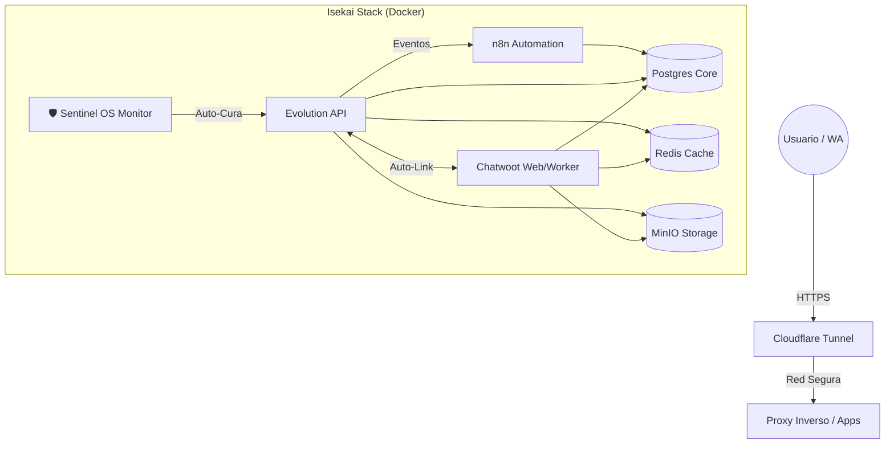

<div align="center">

# ⛩️ ISEKAI STACK (SENTINEL OS)
### Infraestructura Enterprise de Chatbots IA v11.0 [GOLD MASTER]

[]()
[]()
[]()
[]()

*La Infraestructura "Zero-Touch" para Evolution API, Chatwoot y n8n.*

[🚀 Inicio Rápido](#-inicio-rápido) • [🏗 Arquitectura](#-arquitectura) • [🔧 Configuración](#-configuración) • [🩺 Diagnóstico](#-diagnóstico-sentinel-hud)

</div>

---

## 📖 Resumen

**Isekai Stack** es una infraestructura lista para producción, altamente automatizada y diseñada para desplegar y gestionar un ecosistema completo de IA conversacional. Construida bajo la filosofía "Zero-Touch", incluye capacidades de auto-curación, verificación de integridad automatizada y un centro de comando gamificado conocido como **Sentinel OS**.

### 🧩 Componentes Principales
*   **Evolution API v2**: El corazón de la conectividad con WhatsApp.
*   **Chatwoot (Super-Linked)**: Plataforma de soporte omnicanal, provisionada automáticamente.
*   **n8n**: Motor de automatización de flujos para lógica de IA.
*   **Postgres & Redis**: Capa de persistencia y caché de alto rendimiento.
*   **MinIO**: Almacenamiento de objectos S3 compatible (Media & Backups).
*   **Cloudflare Tunnel**: Acceso global seguro, sin configuraciones complejas.

---

## 🏗 Arquitectura



---

## 🚀 Inicio Rápido

### Prerrequisitos
*   Docker & Docker Compose
*   Python 3.9+
*   Git

### Instalación (Zero-Touch)

1.  **Clonar el Repositorio**
    ```bash
    git clone https://github.com/HackUN09/chatbot-stack.git
    cd chatbot-stack
    ```

2.  **Configurar Entorno**
    Copia la plantilla y rellena tus secretos.
    ```bash
    cp ops/config/envs/.env.example .env
    # Edita .env con tus dominios y contraseñas
    ```

3.  **Lanzar Sentinel OS**
    El sistema incluye un Script Maestro que maneja todo.
    ```bash
    ./sistema_maestro.sh
    ```
    *Selecciona la **Opción 1 (Lanzar Sistema Completo)**.*

---

## 🔧 Configuración

La configuración está modularizada para un mejor mantenimiento:

| Archivo | Ubicación | Propósito |
| :--- | :--- | :--- |
| **`.env`** | `raíz` | **Configuración Maestra**. Controla todas las contraseñas, dominios y llaves globales. |
| `internal_evo.env` | `ops/config/envs/` | Ajustes avanzados para Evolution API. |
| `internal_cw.env` | `ops/config/envs/` | Configuración de referencia para Chatwoot. |
| `internal_n8n.env` | `ops/config/envs/` | Configuración de referencia para n8n. |

---

## 🩺 Diagnóstico (Sentinel HUD)

Sentinel OS incluye un HUD (Heads-Up Display) en tiempo real para la gestión del sistema.


### Características Clave
*   **Auto-Curación**: Detecta y corrige automáticamente errores 401 Unauthorized en Evolution API (`sentinel_fixer.py`).
*   **Provisionamiento Inteligente**: Al crear una instancia en Evolution, configura automáticamente la bandeja de entrada en Chatwoot usando llamadas internas a la API.
*   **Bóveda**: Una vista segura de tus credenciales generadas.
*   **Snapshot Génesis**: Copias de seguridad de código y dumps de base de datos con un clic.

### Comandos Útiles

```bash
# Verificar Integridad del Sistema
python ops/scripts/sentinel_fixer.py --silent

# Reconstruir un .env corrupto
python ops/scripts/env_reconstructor.py
```

---

## 📂 Estructura del Proyecto

```text
/
├── .env                  # Secretos Maestros (GitIgnored)
├── sistema_maestro.sh    # Controlador Sentinel OS
├── modules/              # Definiciones Docker Compose
│   ├── 01-infra/        # Bases de Datos & Almacenamiento
│   ├── 02-apps/         # Aplicaciones Principales
│   └── 03-tunnel/       # Red & Networking
└── ops/                  # Centro de Operaciones
    ├── config/envs/     # Plantillas de Configuración
    ├── scripts/         # Automatización Python
    └── docs/            # Documentación Detallada
```

---

## 👤 Autor

**HackUN09**
*   Email: wamr1991.1@gmail.com
*   Rol: Arquitecto de Sistemas & Desarrollador Sentinel OS

---

*Verificado por Sentinel Hyper-Integrity Protocol v11.0*
