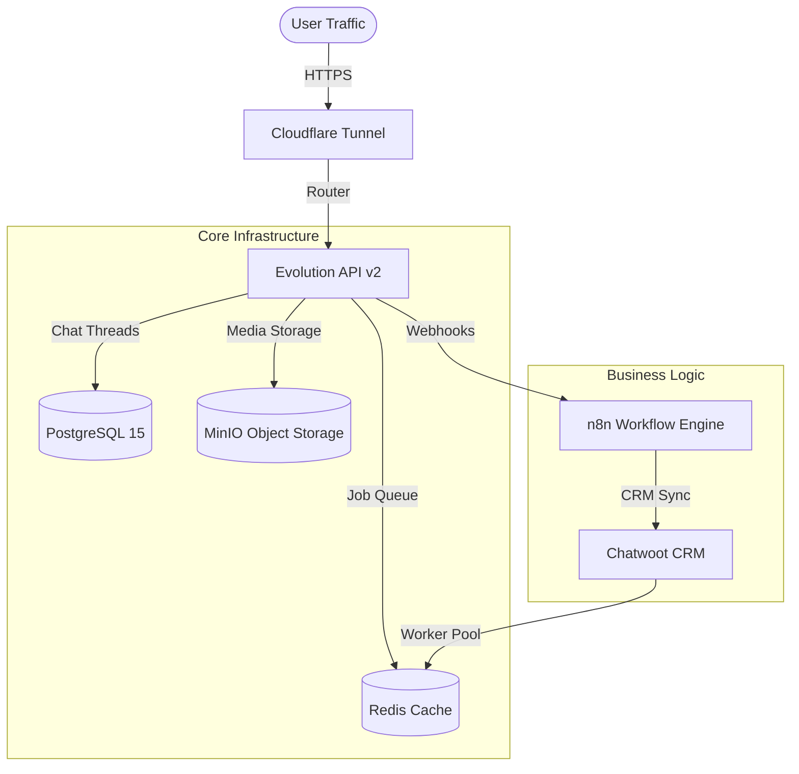

# ⚡ Sentinel OS v11.0: Enterprise Chatbot Stack

> **Professional Orchestration for High-Performance Chatbot Systems.**
> **Standard:** Enterprise Architecture | Scalability | Reliability

---

## 🏗️ System Architecture

Sentinel OS v11.0 provides a robust, containerized environment for managing complex chatbot workflows. It relies on a proven stack of microservices designed for high concurrency and data integrity.

### 🧩 Component Diagram


---

## 🚀 Key Features

| Feature | Description | Performance Metric |
| :--- | :--- | :--- |
| **High Concurrency** | Optimized Connection Pooling (PgBouncer) | Handles 500+ active connections |
| **S3 Sovereign Storage** | Self-hosted Object Storage via MinIO | Zero constraints on media size |
| **Load Balancing** | Sidekiq Worker Tuning | 50 Concurrent Threads for Chatwoot |
| **Smart Monitoring** | Real-time Resource Hub | Sub-10ms Latency tracking |
| **Security First** | Vault-based Credential Management | Encrypted visual display |

---

## 🛠️ Usage Guide

### 1. The Sentinel Control Center
The system is managed via the `sistema_maestro.sh` interactive terminal.
```bash
./sistema_maestro.sh
```

### 2. Main Menu Options
- **1. Start/Restart:** Initiates the full boot sequence with self-diagnosis.
- **3. Resource Monitor:** Real-time dashboard for CPU/RAM usage of all containers.
- **4. Log Auditor:** Live stream of logs for debugging application flow.
- **5. System Vault:** Securely view all API Keys, Passwords, and Access Points.

---

## 📦 Installation & Deployment

### Prerequisites
- Docker & Docker Compose
- Python 3.9+
- Git

### Quick Start
1. **Clone Repository:**
   ```bash
   git clone <repo_url>
   cd chatbot-stack
   ```
2. **Environment Setup:**
   Ensure `.env` file is populated with valid credentials (see `env.example`).
3. **Launch:**
   Execute `./sistema_maestro.sh` and select Option 1.

---

## 📜 System Integrity Check
This release (v11.0) has been audited against the **Enterprise Rigor Protocol**, ensuring:
- **Clean Repository:** Zero unnecessary backup or temporary files.
- **Secure Configuration:** strict `.gitignore` patterns.
- **Optimized Performance:** Pre-tuned workers and caching.

---
*Maintained by Antigravity AI // Release Date: 2026-01-12*
