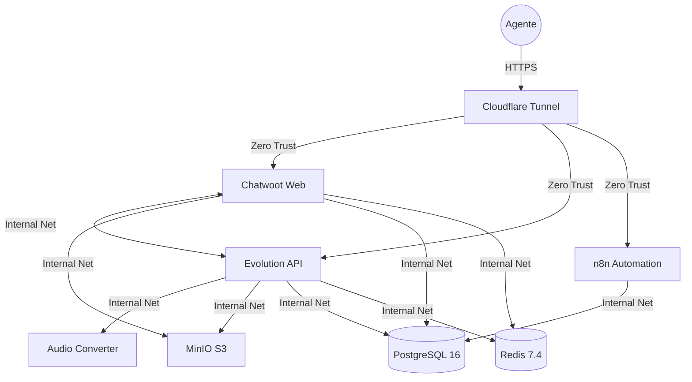

# 🌌 SENTINEL OS v11.1 — The Ultimate Multi-Instance WhatsApp Orchestrator

<div align="center">

[](https://github.com/HackUN09/chatbot-stack)
[](https://github.com/HackUN09/chatbot-stack)
[](https://www.docker.com/)

**Stable. Scalable. Self-Healing. Production-Ready.**

</div>

---

## 🚀 Overview

**Sentinel OS v11.1** is a high-performance, automated ecosystem designed to orchestrate massive WhatsApp operations. It bridges the gap between **Evolution API (v2.3.7)** and **Chatwoot CRM (v3.12.0)**, providing a seamless multi-instance experience with zero-trust security and internal routing optimizations.

This version resolves critical industry-standard bottlenecks:
- 🛡️ **SSRF Hardening**: Eliminated "Invalid Hostname" (422) errors.
- ⚡ **Internal Webhook Patching**: Removed Cloudflare hairpinning latency.
- 🎤 **Media Flow Perfection**: Integrated Audio Converter (Opus to OGG) with real-time health checks.
- 📦 **S3 Unified Storage**: Centralized MinIO infrastructure for cross-service media persistence.

---

## 🏗️ System Architecture

Sentinel OS operates as a **coupled dynamical system** where state equilibrium is maintained by the **Sentinel Engine**.


```mermaid
graph TD
    User((Agente)) -->|HTTPS| CF[Cloudflare Tunnel]
    CF -->|Zero Trust| CW[Chatwoot Web]
    CF -->|Zero Trust| EVO[Evolution API]
    CF -->|Zero Trust| N8N[n8n Automation]
    
    CW <-->|Internal Net| EVO
    EVO -->|Internal Net| AC[Audio Converter]
    CW & EVO -->|Internal Net| MIN[MinIO S3]
    CW & EVO & N8N -->|Internal Net| DB[(PostgreSQL 16)]
    CW & EVO -->|Internal Net| RD[(Redis 7.4)]
```

---

## 🛠️ Key Improvements in v11.1

### 1. Networking & SSRF Security
Chatwoot's security layer often blocks internal Docker communication. We implemented a robust whitelisting system:
- **SSRF Safe List**: `core_minio`, `chatwoot-web`, `evolution_audio_converter`, `app_evolution`.
- **Public CDN Referencing**: Evolution API now uses `S3_PUBLIC_URL` to ensure media delivered to Chatwoot is always accessible via secure public routes.

### 2. The Sentinel Engine (Automation)
Our proprietary `sentinel_engine.py` now performs **Automatic Webhook Patching**. 
- It detects new instances in Evolution API.
- Automatically creates the corresponding Inbox in Chatwoot.
- **Critical Fix**: It patches the webhook URL to use the *internal* Docker hostname (`http://app_evolution:8080`), bypassing external tunnel overhead and preventing timeouts.

### 3. Media Transcoding
- **Audio Converter Health**: Switched from HTTP to TCP probing to ensure a reliable "Healthy" state in Docker.
- **Format Compatibility**: Guaranteed Opus to OGG conversion for flawless WhatsApp voice message playback in the CRM.

---

## 📖 Documentation Index

| Document | Description |
|:---------|:------------|
| [📘 Installation Manual](ops/docs/MANUAL_INSTALACION.md) | Step-by-step guide from zero to hero. |
| [⚙️ Configuration Map](ops/docs/CONFIGURACION_MANUAL.md) | Detailed reference for all 45+ environment variables. |
| [🛡️ Security Architecture](ops/docs/SECURITY.md) | Deep dive into Zero-Trust and SSRF protections. |

---

## ⚡ Quick Start

```bash
# 1. Clone the power
git clone https://github.com/HackUN09/chatbot-stack.git && cd chatbot-stack

# 2. Configure (Edit the 6 essential stars ★)
cp .env.example .env && nano .env

# 3. Ignite
chmod +x sistema_maestro.sh && ./sistema_maestro.sh
# Choose Option 1: GENESIS
```

---

## 🩺 Maintenance & Health

```bash
# Sync all instances manually
python ops/scripts/sentinel_engine.py --fix-evo

# Verify service health
python ops/scripts/sentinel_engine.py --wait

# Repair Database Permissions
python ops/scripts/sentinel_engine.py --fix-db
```

---

<div align="center">

**Sentinel OS — Developed with precision by HackUN09 & Antigravity AI**

</div>
