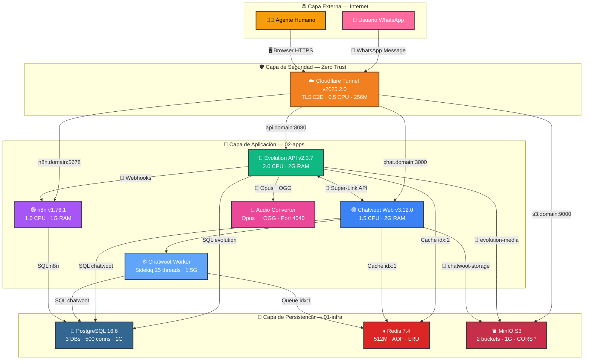

# 🌌 SENTINEL OS v11.0

<div align="center">

### *Sistema Dinámico de Orquestación Conversacional*
#### *Infraestructura Autorreparable de Clase Empresarial*

[](https://github.com/HackUN09/chatbot-stack)
[](https://github.com/HackUN09/chatbot-stack)
[](LICENSE)
[](https://www.docker.com/)

---

> *"Un sistema es tan robusto como la capacidad de sus nodos para autodiagnosticarse y autorepararse"*
> — **Principio de Estabilidad Dinámica, Sentinel v11.0**

</div>

---

## 📐 Formalismo del Sistema

**Sentinel OS** modela la infraestructura conversacional como un **sistema dinámico acoplado** donde cada servicio es un nodo `Sᵢ` del grafo `G = (V, E)`:

```
V = {Evolution, Chatwoot, n8n, MinIO, PostgreSQL, Redis, AudioConverter, Cloudflare}
E = {(Eᵢ, Eⱼ) : Sᵢ depende de Sⱼ}
```

La **función de estado** del sistema se define como:

```
Ψ(t) = ∏ᵢ₌₁⁸ Hᵢ(t)    donde Hᵢ(t) ∈ {0, 1} = healthcheck del servicio i
```

Si `Ψ(t) = 1`, el sistema está en **equilibrio operativo total**. Si `Ψ(t) = 0`, el **Protocolo AEGIS** interviene automáticamente.

---

## 🎯 ¿Qué es Sentinel OS?

Sentinel OS es un ecosistema **100% automatizado** que fusiona 8 servicios Docker en una plataforma conversacional unificada. Su propósito es permitir a cualquier empresa gestionar **WhatsApp Business** a escala, con:

- ✅ **CRM de conversaciones** en tiempo real con múltiples agentes (Chatwoot)
- ✅ **Gateway WhatsApp** multi-device sin API oficial de Meta (Evolution API via Baileys)
- ✅ **Motor de automatización** con workflows visuales e integración IA (n8n)
- ✅ **Almacenamiento multimedia** deduplicado y con CDN pública (MinIO S3)
- ✅ **Audio Transcoding** automático Opus→OGG (fix nativo para audios WhatsApp)
- ✅ **Seguridad Zero-Trust** sin puertos expuestos (Cloudflare Tunnel)
- ✅ **Despliegue en 3 comandos** — Solo cambia credenciales y ejecuta

---

## 🧬 Stack Tecnológico Detallado

### 9 Contenedores Docker — 3 Capas Modulares

| # | Servicio | Imagen Docker | Versión Exacta | Puerto | CPU | RAM | Healthcheck |
|:-:|:---------|:-------------|:--------------|:------:|:---:|:---:|:-----------:|
| S₁ | 🟢 **Chatwoot Web** | `chatwoot/chatwoot` | `v3.12.0` | `3000` | 1.5 | 2G | — |
| S₂ | ⚙️ **Chatwoot Worker** | `chatwoot/chatwoot` | `v3.12.0` | — | 1.5 | 1.5G | — |
| S₃ | 🔵 **Evolution API** | `evoapicloud/evolution-api` | `v2.3.7` | `8080` | 2.0 | 2G | — |
| S₄ | 🎤 **Audio Converter** | `atendai/evolution-audio-converter` | `latest` | `4040` | — | — | ✅ `wget :4040` |
| S₅ | 🟣 **n8n** | `docker.n8n.io/n8nio/n8n` | `1.76.1` | `5678` | 1.0 | 1G | — |
| S₆ | 🐘 **PostgreSQL** | `postgres` | `16.6-alpine` | `5432` | 1.0 | 1G | ✅ `pg_isready` |
| S₇ | ♦️ **Redis** | `redis` | `7.4-alpine` | `6379` | 0.5 | 512M | ✅ `redis-cli ping` |
| S₈ | 🪣 **MinIO** | `minio/minio` | `RELEASE.2024-11-07` | `9000` | 1.0 | 1G | ✅ `curl /health` |
| S₉ | 🛡️ **Cloudflare Tunnel** | `cloudflare/cloudflared` | `2025.2.0` | — | 0.5 | 256M | — |

> **Total de recursos**: ~8.5 CPU cores, ~9.25 GB RAM en carga máxima

### Servicios Init (One-Off)

| Servicio | Imagen | Función | Cuándo corre |
|:---------|:-------|:--------|:-------------|
| `create-buckets` | `minio/mc:RELEASE.2024-11-05` | Crea buckets S3 + políticas públicas | Solo al primer deploy |
| `pgadmin` | `dpage/pgadmin4:8.14` | Panel de administración PostgreSQL | Siempre (localhost:5050) |
| `redis-insight` | `redis/redisinsight:2.62` | UI para explorar Redis | Siempre (localhost:5540) |

---

## 🏗️ Topología de la Arquitectura


```mermaid
graph TB
    subgraph "🌐 Capa Externa — Internet"
        USER["👤 Usuario WhatsApp"]
        AGENT["👩‍💼 Agente Humano"]
    end

    subgraph "🛡️ Capa de Seguridad — Zero Trust"
        CF["☁️ Cloudflare Tunnel v2025.2.0<br/>TLS E2E · 0.5 CPU · 256M"]
    end

    subgraph "🧠 Capa de Aplicación — 02-apps"
        EVO["🔵 Evolution API v2.3.7<br/>2.0 CPU · 2G RAM"]
        CW["🟢 Chatwoot Web v3.12.0<br/>1.5 CPU · 2G RAM"]
        CW_W["⚙️ Chatwoot Worker<br/>Sidekiq 25 threads · 1.5G"]
        N8N["🟣 n8n v1.76.1<br/>1.0 CPU · 1G RAM"]
        AUDIO["🎤 Audio Converter<br/>Opus → OGG · Port 4040"]
    end

    subgraph "💾 Capa de Persistencia — 01-infra"
        PG["🐘 PostgreSQL 16.6<br/>3 DBs · 500 conns · 1G"]
        RD["♦️ Redis 7.4<br/>512M · AOF · LRU"]
        S3["🪣 MinIO S3<br/>2 buckets · 1G · CORS *"]
    end

    USER -->|"📱 WhatsApp Message"| CF
    AGENT -->|"🖥️ Browser HTTPS"| CF
    CF -->|"chat.domain:3000"| CW
    CF -->|"api.domain:8080"| EVO
    CF -->|"n8n.domain:5678"| N8N
    CF -->|"s3.domain:9000"| S3

    EVO <-->|"🔗 Super-Link API"| CW
    EVO -->|"📨 Webhooks"| N8N
    EVO -->|"🎵 Opus→OGG"| AUDIO
    CW --> CW_W

    EVO -->|"SQL evolution"| PG
    CW -->|"SQL chatwoot"| PG
    CW_W -->|"SQL chatwoot"| PG
    N8N -->|"SQL n8n"| PG

    EVO -->|"Cache idx:2"| RD
    CW -->|"Cache idx:1"| RD
    CW_W -->|"Queue idx:1"| RD

    EVO -->|"📁 evolution-media"| S3
    CW -->|"📁 chatwoot-storage"| S3

    style USER fill:#ff6b9d,stroke:#333,stroke-width:2px,color:#fff
    style AGENT fill:#f59e0b,stroke:#333,stroke-width:2px,color:#000
    style CF fill:#f38020,stroke:#333,stroke-width:2px,color:#fff
    style EVO fill:#10b981,stroke:#333,stroke-width:2px,color:#fff
    style CW fill:#3b82f6,stroke:#333,stroke-width:2px,color:#fff
    style CW_W fill:#60a5fa,stroke:#333,stroke-width:2px,color:#fff
    style N8N fill:#a855f7,stroke:#333,stroke-width:2px,color:#fff
    style AUDIO fill:#ec4899,stroke:#333,stroke-width:2px,color:#fff
    style PG fill:#336791,stroke:#333,stroke-width:2px,color:#fff
    style RD fill:#dc2626,stroke:#333,stroke-width:2px,color:#fff
    style S3 fill:#c72e49,stroke:#333,stroke-width:2px,color:#fff
```

---

## ⚡ Despliegue Zero-Touch (3 Comandos)

```bash
# ① Clonar el repositorio
git clone https://github.com/HackUN09/chatbot-stack.git && cd chatbot-stack

# ② Configurar credenciales (solo 6 variables obligatorias)
cp .env.example .env && nano .env

# ③ Despliegue total automático
chmod +x sistema_maestro.sh && ./sistema_maestro.sh   # → Opción 1: GENESIS
```

### 📋 Prerrequisitos

| # | Requisito | Verificar con | Instalación rápida |
|:-:|:----------|:-------------|:-------------------|
| 1 | Docker Engine 24.0+ | `docker --version` | `curl -fsSL https://get.docker.com \| sh` |
| 2 | Docker Compose v2.20+ | `docker compose version` | Incluido en Docker Desktop |
| 3 | Dominio + Cloudflare Tunnel | [one.dash.cloudflare.com](https://one.dash.cloudflare.com/) | Cuenta gratuita |

### 🎯 Variables Obligatorias (6 mínimo)

| Variable | Ejemplo | Dónde obtenerlo |
|:---------|:--------|:---------------|
| `DOMAIN` | `miempresa.com` | Tu registrador de dominios |
| `CLOUDFLARE_TUNNEL_TOKEN` | `eyJhIjoiMD...` | Cloudflare → Networks → Tunnels → Create |
| `CHATWOOT_ADMIN_EMAIL` | `admin@miempresa.com` | Tu email real |
| `CHATWOOT_ADMIN_PASSWORD` | `P@ssw0rd2024!` | Elige uno seguro |
| `POSTGRES_ROOT_PASSWORD` | `DbS3cur3!` | Genera con `openssl rand -base64 32` |
| `SECRET_KEY_BASE` | (64 bytes hex) | Genera con `openssl rand -hex 64` |

> [!TIP]
> Las demás 41 variables tienen valores predeterminados funcionales. Cámbialas para producción real.

---

## 🔑 Mapa de Variables de Entorno (47 variables en 12 secciones)

El archivo `.env` contiene **47 variables** organizadas en **12 secciones**. Cada una está documentada en `.env.example` con su servicio origen, propósito, y advertencias.

| Sección | Variables | Servicios que las usan |
|:--------|:---------:|:-----------------------|
| `[01]` 🌐 Dominio | 2 | Chatwoot, Evolution, n8n, Cloudflare |
| `[02]` 💬 Chatwoot | 7 | chatwoot-web, chatwoot-worker, Evolution |
| `[03]` 🛠️ Infra | 2 | db_core, cache_core |
| `[04]` 🧬 DBs | 3 | db_core (init-script), Evolution, Chatwoot, n8n |
| `[05]` 🔑 Seguridad | 3 | Evolution, n8n |
| `[06]` 📱 Evolution | 4 | app_evolution |
| `[07]` 🎤 Audio | 5 | app_evolution, evolution_audio_converter |
| `[08]` 🪣 MinIO S3 | 12 | core_minio, app_evolution, chatwoot-web |
| `[09]` 👤 Admin | 2 | pgadmin |
| `[10]` ⚙️ n8n | 2 | app_n8n_editor |
| `[11]` 🛡️ AEGIS | 3 | app_n8n_editor |
| `[12]` 🔗 Import | 1 | app_evolution (importar historial a Chatwoot) |

### Distribución de Bases de Datos PostgreSQL

| Base de Datos | Usuario | Creada por | Extensiones |
|:-------------|:--------|:----------|:-----------|
| `chatwoot` | `chatwoot_user` | `01-segregation.sh` | pgcrypto, uuid-ossp |
| `evolution` | `evolution_user` | `01-segregation.sh` | pgcrypto, uuid-ossp |
| `n8n` | `n8n_user` | `01-segregation.sh` | pgcrypto, uuid-ossp |

### Distribución de Redis Indexes

| Index | Servicio | Función |
|:-----:|:---------|:--------|
| 0 | Reservado | — |
| 1 | Chatwoot (Sidekiq + ActionCable) | Cola de jobs en background + WebSockets |
| 2 | Evolution API | Caché de sesiones WhatsApp (TTL: 7 días) |

### Buckets MinIO S3

| Bucket | Política | Contenido |
|:-------|:---------|:----------|
| `evolution-media` | `download` (público) | Imágenes, videos, audios, stickers, documentos de WhatsApp |
| `chatwoot-storage` | `download` (público) | Adjuntos del CRM, avatares, logos de inbox |

---

## 🚀 Qué Hace el `sistema_maestro.sh` Exactamente

El orquestador tiene **5 opciones**. La más importante es **Opción 1: GENESIS**:

### Secuencia de GENESIS (Opción 1)

```
Paso 0  → docker network create secure-net
           Crea la red privada compartida entre todos los contenedores.

Paso 1  → docker compose -p 01-infra up -d
           Levanta PostgreSQL, Redis, MinIO, PgAdmin, Redis Insight.
           El servicio create-buckets espera a que MinIO esté healthy,
           luego crea los 2 buckets con política download.

Paso 2  → sentinel_engine.py --fix-db
           Ejecuta ALTER ROLE para garantizar que los 3 usuarios DB
           existan con las contraseñas del .env (idempotente).

Paso 3  → docker compose -p 02-apps up -d
           Levanta Chatwoot Web+Worker, Evolution API, Audio Converter, n8n.
           Chatwoot ejecuta 'rails db:prepare' en su primer arranque
           (migra ~200 tablas, toma 2-3 minutos).

Paso 4  → docker compose -p 03-tunnel up -d
           Levanta el túnel Cloudflare que conecta los 4 subdominios.

Paso 5  → sentinel_engine.py --wait
           Espera hasta que TODOS los servicios respondan HTTP 200.
           Timeout: 120 segundos. Reintenta cada 5 segundos.

Paso 6  → sentinel_engine.py --setup-s3
           Configura CORS en MinIO, verifica buckets, y ejecuta
           heal_media() para corregir MIME types de archivos existentes.

Paso 7  → sentinel_engine.py --setup-cw
           Consulta la API de Chatwoot para obtener el access_token
           del admin y lo inyecta en el .env como CHATWOOT_GLOBAL_TOKEN.

Paso 8  → sentinel_engine.py --fix-evo
           Sincroniza Evolution con Chatwoot: verifica que el Super-Link
           esté activo y que los webhooks estén configurados.

RESULTADO → Dashboard con credenciales de todos los servicios
```

### Otras opciones del menú

| Opción | Nombre | Qué hace |
|:------:|:-------|:---------|
| 1 | GENESIS | Despliegue completo (secuencia de arriba) |
| 2 | STATUS | Muestra el estado de todos los contenedores + health |
| 3 | CREDENTIALS | Muestra las credenciales desde el .env |
| 4 | REPAIR & SYNC | Reinicia servicios, resincroniza Evolution↔Chatwoot |
| 5 | SHUTDOWN | Detiene todos los contenedores (datos persisten) |

---

## 📦 Estructura Completa del Proyecto

```
chatbot-stack/
│
├── 📂 modules/                          # Docker Compose organizados por capa
│   ├── 📂 01-infra/                     # CAPA DE PERSISTENCIA
│   │   ├── docker-compose.yml           # PostgreSQL 16.6, Redis 7.4, MinIO, PgAdmin, Redis Insight
│   │   └── init-scripts/
│   │       └── 01-segregation.sh        # Crea 3 DBs + 3 usuarios + extensiones (auto en primer boot)
│   ├── 📂 02-apps/                      # CAPA DE APLICACIÓN
│   │   ├── docker-compose.yml           # Chatwoot Web+Worker, Evolution, Audio Converter, n8n
│   │   └── chatwoot-storage.yml         # Config S3 para Rails ActiveStorage (monta en /app/config/storage.yml)
│   └── 📂 03-tunnel/                    # CAPA DE SEGURIDAD
│       └── docker-compose.yml           # Cloudflare Tunnel v2025.2.0
│
├── 📂 ops/                              # CENTRO DE OPERACIONES
│   ├── 📂 docs/                         # Documentación técnica v11.0
│   │   ├── MANUAL_INSTALACION.md        # Guía paso a paso + 6 problemas resueltos
│   │   ├── CONFIGURACION_MANUAL.md      # Mapa de 47 variables por servicio
│   │   ├── auditoria_arquitectonica_v11.md  # Análisis por servicio + score 8.8/10
│   │   ├── protocolo_aegis_v11.md       # 4 capas de auto-curado con fórmulas
│   │   └── flujo_arquitectonico_sentinel.md # Flujo de un mensaje WhatsApp completo
│   ├── 📂 config/envs/                  # Archivos de referencia (.env por servicio)
│   │   ├── internal_cw.env              # Variables de Chatwoot (mapa de dinámicas)
│   │   ├── internal_evo.env             # Variables de Evolution (✅ activas / ⬚ opcionales)
│   │   ├── internal_n8n.env             # Variables de n8n + Protocolo AEGIS
│   │   └── internal_db.env              # Infra: mapa de Redis indexes y DBs
│   ├── 📂 scripts/                      # Scripts de mantenimiento
│   │   ├── sentinel_engine.py           # Motor principal (--setup-s3, --setup-cw, --heal-media, etc.)
│   │   ├── fix_media_metadata.py        # Fix MIME types audio/video en MinIO
│   │   ├── fix-media-metadata.sh        # Versión shell del fix
│   │   ├── clean-docker.sh              # Limpieza total de Docker (nuclear)
│   │   └── stress_test_enigma.py        # Test de carga del sistema
│   └── 📂 backups/                      # Snapshots y respaldos
│       └── snapshots/                   # (ignorado por Git)
│
├── 📂 persistence/                      # VOLÚMENES DOCKER (datos reales, ignorados por Git)
│   ├── postgres/                        # Data dir de PostgreSQL (3 DBs)
│   ├── redis/                           # AOF de Redis (durabilidad)
│   ├── minio/                           # Archivos multimedia S3
│   ├── n8n/                             # Workflows + credenciales cifradas
│   ├── evolution/                       # Instancias WhatsApp
│   │   ├── instances/                   # Sesión activa de cada número
│   │   └── store/                       # Mensajes en caché local
│   └── redisinsight_data/               # Config de Redis Insight
│
├── 🔧 .env                             # Secretos reales (NUNCA en Git)
├── 🔧 .env.example                     # Plantilla documentada (47 vars, 12 secciones)
├── 🔧 .env.bank                        # Backup de credenciales (NUNCA en Git)
├── 🚀 sistema_maestro.sh               # Orquestador v11.1 (5 opciones)
├── 📋 .gitignore                        # Protege .env, persistence/, logs, snapshots
├── 📖 README.md                         # Este archivo
└── 📦 package.json                      # Referencia de Evolution API (no se usa para build)
```

---

## 🩺 Problemas Resueltos — Registro Técnico Detallado

### 🔴 Issue #1: Audios de WhatsApp no se reproducen en Chatwoot

**Severidad**: Crítica — Afecta experiencia del agente humano

**Síntoma**: Los mensajes de audio de WhatsApp aparecen en Chatwoot pero al presionar Play no suenan. El botón gira eternamente. Los videos se reproducen pero sin audio.

**Causa Raíz** (triple):

```
Causa 1: MIME Type Incorrecto
WhatsApp envía audio como .opus con codec Opus de 48kHz.
MinIO almacenaba con Content-Type: audio/opus
Los navegadores (Chrome, Firefox) NO reproducen audio/opus inline.
Solo reconocen: audio/ogg, audio/mpeg, audio/wav como reproducibles.

Causa 2: Content-Disposition Incorrecto
MinIO serve los archivos con Content-Disposition: attachment
Esto fuerza al navegador a DESCARGAR en vez de REPRODUCIR inline.
Chatwoot necesita Content-Disposition: inline para el player HTML5.

Causa 3: Transcoding Deshabilitado
El servicio evolution_audio_converter no estaba en el docker-compose.
Los audios se almacenaban en formato raw Opus sin transcodificar.
```

**Pipeline de Solución** (automática en v11.0):

```
                    ┌─────────────────────────┐
Antes:              │ WhatsApp → .opus → MinIO → Browser ❌ |
                    │ (audio/opus, attachment)              │
                    └─────────────────────────┘

                    ┌─────────────────────────────────────────┐
Después:            │ WhatsApp → .opus → AudioConverter → .ogg → MinIO → Browser ✅ |
                    │             ↓                                                   │
                    │      Port 4040                                                  │
                    │      Content-Type: audio/ogg                                    │
                    │      Content-Disposition: inline                                │
                    └─────────────────────────────────────────┘
```

**Archivos modificados**: `modules/02-apps/docker-compose.yml` (añadido servicio `evolution_audio_converter`), `.env.example` (sección Audio [07]), `sentinel_engine.py` (función `heal_media()`)

---

### 🔴 Issue #2: S3_ENDPOINT inconsistente entre archivos

**Severidad**: Crítica — Evolution no podía subir archivos

**Síntoma**: Evolution API logeaba `ECONNREFUSED` al intentar subir multimedia a MinIO. Las imágenes en Chatwoot mostraban ícono roto.

**Causa Raíz**: El contenedor Docker se llama `core_minio` (con guión bajo), pero el `.env` y la documentación referenciaban `minio-core` (con guión medio). Docker DNS no resuelve nombres que no coinciden exactamente.

```
.env                  → S3_ENDPOINT=minio-core  ❌ (no existe en Docker DNS)
docker-compose.yml    → container_name: core_minio  ← nombre real
Resultado: ECONNREFUSED al intentar http://minio-core:9000
```

**Solución**: Se unificó a `core_minio` en **7 archivos**:
- `.env`, `.env.example`, `.env.bank`
- `CONFIGURACION_MANUAL.md`, `MANUAL_INSTALACION.md`, `README.md`
- Archivos de referencia internos

---

### 🔴 Issue #3: QR Code de WhatsApp no aparece

**Severidad**: Media — Bloquea onboarding de nuevas líneas

**Síntoma**: El endpoint `/instance/connect` de Evolution API devolvía timeout.

**Causa Raíz**: Baileys (la librería que emula WhatsApp Web) requiere una versión de WhatsApp Web que esté en la lista de permitidas de Meta. La versión por defecto estaba obsoleta.

**Solución**: `CONFIG_SESSION_PHONE_VERSION=2.3000.1033351060` en el `.env`. Esta versión está verificada como funcional con la API de WhatsApp Web.

---

### 🟡 Issue #4: UnicodeEncodeError en Windows (charmap codec)

**Severidad**: Media — Solo afecta despliegue desde Windows

**Síntoma**: `sentinel_engine.py` fallaba con `UnicodeEncodeError: 'charmap' codec can't encode character` al escribir el `.env`.

**Causa Raíz**: Windows usa codificación `cp1252` por defecto, pero el `.env` contiene emojis y caracteres UTF-8 en los comentarios. `open()` sin especificar encoding usa la codificación del sistema.

**Solución**: Se añadió `encoding='utf-8'` a todos los `open()` en `sentinel_engine.py`.

---

### 🟡 Issue #5: Chatwoot 502 Bad Gateway los primeros minutos

**Severidad**: Baja (esperado) — Solo ocurre en primer despliegue

**Síntoma**: Cloudflare devuelve 502 al acceder a `chat.domain` durante 2-3 minutos.

**Causa Raíz**: Chatwoot ejecuta `bundle exec rails db:prepare` que migra ~200 tablas en el primer arranque. Hasta que termine, el servidor Puma no escucha en el puerto 3000, y Cloudflare Tunnel devuelve 502.

**Solución**: Comportamiento esperado. Se documentó el tiempo de espera. Se añadió `sentinel_engine.py --wait` al script GENESIS que espera activamente hasta que Chatwoot responda HTTP 200.

---

### 🟢 Issue #6: Versión incorrecta en .gitignore

**Severidad**: Baja (cosmético)

**Síntoma**: El header del `.gitignore` decía `v17.0` en vez de `v11.0`.

**Solución**: Se reescribió completamente con versión correcta, y se añadieron exclusiones para `snapshots/`, `node_modules/`, `dist/`, `diagnostic_*.txt`.

---

## 🔒 Modelo de Seguridad Zero-Trust

```
┌──────────────────────────────────────────────────────┐
│  🌐 INTERNET                                         │
│  ┌────────────────────────────────────────────────┐  │
│  │  ☁️ CLOUDFLARE TUNNEL (TLS E2E, v2025.2.0)     │  │
│  │  • 4 subdominios: chat, api, n8n, s3           │  │
│  │  • SSL automático por Cloudflare               │  │
│  │  ┌──────────────────────────────────────────┐  │  │
│  │  │  🔒 RED DOCKER PRIVADA (secure-net)      │  │  │
│  │  │                                          │  │  │
│  │  │  • PostgreSQL: sin port binding           │  │  │
│  │  │    (solo accesible desde otros containers)│  │  │
│  │  │  • Redis: password + solo red interna     │  │  │
│  │  │  • MinIO: 127.0.0.1:9000 (solo localhost) │  │  │
│  │  │  • Apps: 127.0.0.1:PORT (solo localhost)  │  │  │
│  │  │  • .env: protegido por .gitignore         │  │  │
│  │  │  • .env.bank: backup, también protegido   │  │  │
│  │  └──────────────────────────────────────────┘  │  │
│  └────────────────────────────────────────────────┘  │
└──────────────────────────────────────────────────────┘
```

**Medidas activas**:
- ✅ **0 puertos expuestos** al internet — todo vía Cloudflare Tunnel
- ✅ **Red Docker aislada** (`secure-net`) — servicios solo se ven entre sí
- ✅ **Healthchecks** en 4 servicios con auto-restart (`restart: always` en todos)
- ✅ **Credenciales segregadas** — cada servicio tiene su propio usuario DB
- ✅ **`.gitignore` blindado** — protege `.env`, `.env.bank`, `persistence/`, `logs/`
- ✅ **Puerto binding local** — MinIO, PgAdmin, Redis Insight solo en `127.0.0.1`

---

## 📚 Documentación Completa

| Documento | Líneas | Descripción |
|:----------|:------:|:------------|
| 🧬 [**GUÍA DE RÉPLICA**](GUIA_REPLICA.md) | ~300 | **EMPIEZA AQUÍ** — Del `git clone` al sistema funcionando en 10 pasos |
| 📘 [**Manual de Instalación**](ops/docs/MANUAL_INSTALACION.md) | ~230 | Paso a paso desde cero, 6 problemas resueltos con causa raíz |
| 🔧 [**Configuración Manual**](ops/docs/CONFIGURACION_MANUAL.md) | ~210 | Mapa de 47 variables por servicio, Redis indexes, diagnóstico |
| 🛡️ [**Protocolo AEGIS**](ops/docs/protocolo_aegis_v11.md) | ~160 | 4 capas de auto-curado, fórmulas de detección de fallos |
| 🏛️ [**Flujo Arquitectónico**](ops/docs/flujo_arquitectonico_sentinel.md) | ~180 | Diagrama de secuencia del flujo completo de un mensaje WA |
| 🔬 [**Auditoría Arquitectónica**](ops/docs/auditoria_arquitectonica_v11.md) | ~220 | Análisis servicio por servicio, matriz de deps, score 8.8/10 |

---

## 🔄 Operaciones de Mantenimiento

| Operación | Comando | Frecuencia |
|:----------|:--------|:-----------|
| 🔄 Actualizar stack | `git pull && ./sistema_maestro.sh → Opción 4` | Semanal |
| 💾 Backup completo | `tar -czf backup-$(date +%Y%m%d).tar.gz persistence/` | Diario |
| 📊 Ver logs en vivo | `docker compose -p 02-apps logs -f` | Ad-hoc |
| 🔬 Health check global | `docker ps --format "table {{.Names}}\t{{.Status}}"` | Ad-hoc |
| 🧹 Limpieza Docker | `./ops/scripts/clean-docker.sh` | Mensual |
| 🎤 Fix audio metadata | `python ops/scripts/fix_media_metadata.py` | Si hay audios erróneos |
| 🪣 Fix S3 MIME types | `python ops/scripts/sentinel_engine.py --heal-media` | Tras migración |
| 🛑 Apagar todo | `./sistema_maestro.sh → Opción 5` | Ad-hoc |

---

## 🎯 Acceso a Servicios Desplegados

| Servicio | URL | Credenciales |
|:---------|:----|:-------------|
| 💬 **Chatwoot CRM** | `https://chat.tudominio.com` | `CHATWOOT_ADMIN_EMAIL` / `PASSWORD` del .env |
| 🔵 **Evolution API** | `https://api.tudominio.com` | Header `apikey: EVOLUTION_API_KEY` |
| 🟣 **n8n Automation** | `https://n8n.tudominio.com` | Se crea en el primer acceso web |
| 🪣 **MinIO Console** | `http://localhost:9001` | `minioadmin` / `MINIO_ROOT_PASSWORD` |
| 🐘 **PgAdmin** | `http://localhost:5050` | `PGADMIN_DEFAULT_EMAIL` / `PASSWORD` |
| ♦️ **Redis Insight** | `http://localhost:5540` | Sin password (solo acceso local) |

---

<div align="center">

### 🛟 ¿Problemas? ¿Ideas? ¿Mejoras?

Abre un [**Issue en GitHub**](https://github.com/HackUN09/chatbot-stack/issues) — Respondemos rápido

---

*Sentinel OS v11.0 — Construido aplicando principios de Sistemas Dinámicos, Arquitectura de Microservicios y Zero-Trust Security*

**Desarrollado con 🧬 por [HackUN09](https://github.com/HackUN09) & Antigravity AI**

[](https://github.com/HackUN09)
[](https://www.docker.com/)

📜 Licencia MIT — Libre para uso comercial y personal

</div>
