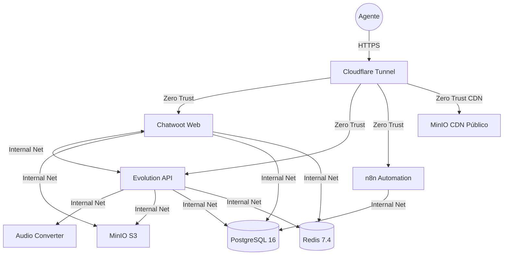

# 🌌 SENTINEL OS v11.1 — The Ultimate Multi-Instance WhatsApp Orchestrator

<div align="center">

[](https://github.com/HackUN09/chatbot-stack)
[](https://github.com/HackUN09/chatbot-stack)
[](https://www.docker.com/)
[](LICENSE)
[](https://github.com/HackUN09)

**Stable. Scalable. Self-Healing. Production-Ready.**

*Construido aplicando principios de Sistemas Dinámicos, Arquitectura de Microservicios y Zero-Trust Security*

</div>

---

## 🚀 Overview

**Sentinel OS v11.1** es un ecosistema de alto rendimiento y auto-sanación diseñado para orquestar operaciones masivas de WhatsApp. Cierra la brecha entre **Evolution API (v2.3.7)** y **Chatwoot CRM (v3.12.0)**, proporcionando una experiencia multi-instancia sin fricciones con seguridad Zero-Trust y optimizaciones de enrutamiento interno.

Esta versión resuelve cuellos de botella críticos del sector:
- 🛡️ **SSRF Hardening**: Eliminación de errores "Invalid Hostname" (422) que bloqueaban la comunicación interna.
- ⚡ **Internal Webhook Patching**: Eliminación de la latencia de hairpinning de Cloudflare mediante enrutamiento interno.
- 🎤 **Media Flow Perfection**: Converter de Audio (Opus → OGG) con healthchecks TCP en tiempo real.
- 📦 **S3 Unified Storage**: Infraestructura MinIO centralizada para persistencia de multimedia cross-service.
- 🐘 **Windows Compatibility**: Encoding UTF-8 forzado y uso de `127.0.0.1` para máxima estabilidad en despliegue desde Windows.

---

## 🏗️ Arquitectura del Sistema

Sentinel OS opera como un **sistema dinámico acoplado** donde el equilibrio de estado es mantenido por el **Sentinel Engine**.


```mermaid
graph TD
    User((Agente)) -->|HTTPS| CF[Cloudflare Tunnel]
    CF -->|Zero Trust| CW[Chatwoot Web]
    CF -->|Zero Trust| EVO[Evolution API]
    CF -->|Zero Trust| N8N[n8n Automation]
    CF -->|Zero Trust CDN| MIN_PUB[MinIO CDN Público]

    CW <-->|Internal Net| EVO
    EVO -->|Internal Net| AC[Audio Converter]
    CW & EVO -->|Internal Net| MIN[MinIO S3]
    CW & EVO & N8N -->|Internal Net| DB[(PostgreSQL 16)]
    CW & EVO -->|Internal Net| RD[(Redis 7.4)]
```

---

## 🛠️ Mejoras Clave en v11.1

### 1. Networking & Seguridad SSRF
La capa de seguridad de Chatwoot bloquea frecuentemente la comunicación Docker interna. Implementamos un sistema de whitelisting robusto:
- **SSRF Safe List**: `core_minio`, `chatwoot-web`, `evolution_audio_converter`, `app_evolution`.
- **Public CDN Referencing**: Evolution API ahora usa `S3_PUBLIC_URL` para que los archivos entregados a Chatwoot siempre sean accesibles por rutas públicas seguras.

### 2. El Sentinel Engine (Automatización)
Nuestro `sentinel_engine.py` ahora realiza **Automatic Webhook Patching**:
- Detecta nuevas instancias en Evolution API.
- Crea automáticamente el Inbox correspondiente en Chatwoot.
- **Fix Crítico**: Parchea la URL del webhook para usar el hostname Docker interno (`http://app_evolution:8080`), eliminando overhead del túnel externo y previniendo timeouts.

### 3. Media Transcoding
- **Audio Converter Health**: Cambiado de HTTP a TCP probing para garantizar estado "Healthy" en Docker.
- **Format Compatibility**: Conversión garantizada Opus → OGG para reproducción perfecta de mensajes de voz de WhatsApp en el CRM.
- **MIME Healing**: `--heal-media` corrige automáticamente `Content-Type` y `Content-Disposition` de archivos legacy en MinIO.

---

## 🐛 Issues Resueltos (Registro Técnico)

### 🔴 Issue #1: Chatwoot bloqueaba media de Evolution API (422 SSRF)
**Severidad**: Crítica — Impedía mostrar imágenes/audio de WhatsApp en el CRM.

**Causa Raíz**: Chatwoot (Rails) bloquea peticiones a hostnames internos de Docker por protección SSRF.

**Solución**: `SSRF_SAFE_LIST` + `S3_PUBLIC_URL` en Evolution API para que las referencias a archivos usen la URL pública del CDN, no la interna.

---

### 🔴 Issue #2: Timeout de 30s en webhooks (Hairpinning)
**Severidad**: Crítica — Mensajes de WhatsApp llegaban con 30s de delay o no llegaban.

**Síntoma**: `chatwoot-worker` logs mostraban `Timed out reading data from server`.

**Causa Raíz**: Chatwoot enviaba eventos a `https://api.tudominio.com` (pasando por Cloudflare y volviendo), en lugar de ir directo al contenedor.

**Solución**: `sentinel_engine.py` parchea dinámicamente el webhook URL a `http://app_evolution:8080` tras cada sincronización.

---

### 🔴 Issue #3: DNS interno inconsistente (`minio-core` vs `core_minio`)
**Síntoma**: `ECONNREFUSED` al intentar `http://minio-core:9000`.

**Solución**: Unificado a `core_minio` (nombre real del contenedor) en 7 archivos: `.env`, `.env.example`, `docker-compose.yml` y documentación.

---

### 🟡 Issue #4: QR Code de WhatsApp no aparece
**Causa Raíz**: Versión de WhatsApp Web obsoleta en Baileys.

**Solución**: `CONFIG_SESSION_PHONE_VERSION=2.3000.1033351060` en el `.env`.

---

### 🟡 Issue #5: UnicodeEncodeError en Windows
**Síntoma**: `sentinel_engine.py` fallaba con `charmap codec can't encode character`.

**Solución**: `encoding='utf-8'` añadido a todos los `open()` del Sentinel Engine. Fallback multi-encoding en `load_env()`.

---

### 🟡 Issue #6: Chatwoot 502 los primeros minutos
**Causa Raíz**: `db:prepare` migra ~200 tablas en el primer arranque. Puma no escucha hasta que termina.

**Solución**: Comportamiento esperado, documentado. `sentinel_engine.py --wait` espera activamente HTTP 200 antes de proceder.

---

## 🔒 Modelo de Seguridad Zero-Trust

```
┌──────────────────────────────────────────────────────┐
│  🌐 INTERNET                                         │
│  ┌────────────────────────────────────────────────┐  │
│  │  ☁️ CLOUDFLARE TUNNEL (TLS E2E)                 │  │
│  │  • 4 subdominios: chat, api, n8n, s3           │  │
│  │  • SSL automático por Cloudflare               │  │
│  │  ┌──────────────────────────────────────────┐  │  │
│  │  │  🔒 RED DOCKER PRIVADA (secure-net)      │  │  │
│  │  │                                          │  │  │
│  │  │  • PostgreSQL: sin port binding           │  │  │
│  │  │    (solo accesible desde containers)      │  │  │
│  │  │  • Redis: password + solo red interna     │  │  │
│  │  │  • MinIO: 127.0.0.1:9000 (solo localhost) │  │  │
│  │  │  • Apps: 127.0.0.1:PORT (solo localhost)  │  │  │
│  │  │  • .env: protegido por .gitignore         │  │  │
│  │  └──────────────────────────────────────────┘  │  │
│  └────────────────────────────────────────────────┘  │
└──────────────────────────────────────────────────────┘
```

**Medidas activas**:
- ✅ **0 puertos expuestos** al internet — todo vía Cloudflare Tunnel
- ✅ **Red Docker aislada** (`secure-net`) — servicios solo se ven entre sí
- ✅ **Healthchecks** en todos los servicios con `restart: always`
- ✅ **Credenciales segregadas** — cada servicio tiene su propio usuario DB
- ✅ **`.gitignore` blindado** — protege `.env`, `.env.bank`, `persistence/`, `logs/`
- ✅ **Puerto binding local** — MinIO, PgAdmin, Redis Insight solo en `127.0.0.1`
- ✅ **SSRF Hardening** — whitelist explícita de servicios internos en Chatwoot

---

## ⚡ Quick Start

```bash
# 1. Clonar el repositorio
git clone https://github.com/HackUN09/chatbot-stack.git && cd chatbot-stack

# 2. Configurar (edita las 6 variables esenciales marcadas con ★)
cp .env.example .env && nano .env

# 3. Encender el sistema
chmod +x sistema_maestro.sh && ./sistema_maestro.sh
# Elegir Opción 1: GENESIS
```

---

## 🩺 Comandos de Mantenimiento (Sentinel Engine)

```bash
# Sincronizar todas las instancias de WhatsApp con Chatwoot
python ops/scripts/sentinel_engine.py --fix-evo

# Esperar y verificar que TODOS los servicios estén listos
python ops/scripts/sentinel_engine.py --wait

# Reparar permisos y usuarios de Base de Datos
python ops/scripts/sentinel_engine.py --fix-db

# Configurar buckets MinIO y políticas S3
python ops/scripts/sentinel_engine.py --setup-s3

# Corregir MIME types de audio/video en MinIO
python ops/scripts/sentinel_engine.py --heal-media

# Ejecutar migraciones de Chatwoot si se requiere
python ops/scripts/sentinel_engine.py --prep-cw
```

---

## 🔄 Tabla de Operaciones

| Operación | Comando | Frecuencia |
|:----------|:--------|:-----------|
| 🔄 Actualizar stack | `git pull && ./sistema_maestro.sh → Opción 4` | Semanal |
| 💾 Backup completo | `tar -czf backup-$(date +%Y%m%d).tar.gz persistence/` | Diario |
| 📊 Ver logs en vivo | `docker compose -p 02-apps logs -f` | Ad-hoc |
| 🔬 Health check global | `docker ps --format "table {{.Names}}\t{{.Status}}"` | Ad-hoc |
| 🧹 Limpieza Docker | `./ops/scripts/clean-docker.sh` | Mensual |
| 🎤 Fix audio metadata | `python ops/scripts/fix_media_metadata.py` | Si hay audios erróneos |
| 🪣 Fix S3 MIME types | `python ops/scripts/sentinel_engine.py --heal-media` | Tras migración |
| 🛑 Apagar todo | `./sistema_maestro.sh → Opción 5` | Ad-hoc |

---

## 🎯 Acceso a Servicios Desplegados

| Servicio | URL | Credenciales |
|:---------|:----|:-------------|
| 💬 **Chatwoot CRM** | `https://chat.tudominio.com` | `CHATWOOT_ADMIN_EMAIL` / `PASSWORD` del .env |
| 🔵 **Evolution API** | `https://api.tudominio.com` | Header `apikey: EVOLUTION_API_KEY` |
| 🟣 **n8n Automation** | `https://n8n.tudominio.com` | Se crea en el primer acceso web |
| 🪣 **MinIO Console** | `http://localhost:9001` | `minioadmin` / `MINIO_ROOT_PASSWORD` |
| 🐘 **PgAdmin** | `http://localhost:5050` | `PGADMIN_DEFAULT_EMAIL` / `PASSWORD` |
| ♦️ **Redis Insight** | `http://localhost:5540` | Sin password (solo acceso local) |

---

## 📚 Documentación Completa

| Documento | Descripción |
|:----------|:------------|
| 📘 [**Manual de Instalación**](ops/docs/MANUAL_INSTALACION.md) | Paso a paso desde cero, issues reales resueltos con causa raíz |
| ⚙️ [**Configuración Manual**](ops/docs/CONFIGURACION_MANUAL.md) | Mapa de 45+ variables por servicio, Redis indexes, diagnóstico |
| 🛡️ [**Security Architecture**](ops/docs/SECURITY.md) | Deep dive en Zero-Trust, SSRF Hardening y protocolos de red |
| 📋 [**Guía de Réplica**](ops/docs/GUIA_REPLICA.md) | Del `git clone` al sistema funcionando — guía de despliegue rápido |
| 🔬 [**Ejemplos n8n**](ops/docs/examples/) | Flujos de automatización listos para importar en n8n |

---

<div align="center">

### 🛟 ¿Problemas? ¿Ideas? ¿Mejoras?

Abre un [**Issue en GitHub**](https://github.com/HackUN09/chatbot-stack/issues)

---

*Sentinel OS v11.1 — Construido aplicando principios de Sistemas Dinámicos, Arquitectura de Microservicios y Zero-Trust Security*

**Desarrollado con 🧬 por [HackUN09](https://github.com/HackUN09) & Antigravity AI**

[](https://www.docker.com/)

📜 Licencia MIT — Libre para uso comercial y personal

</div>
