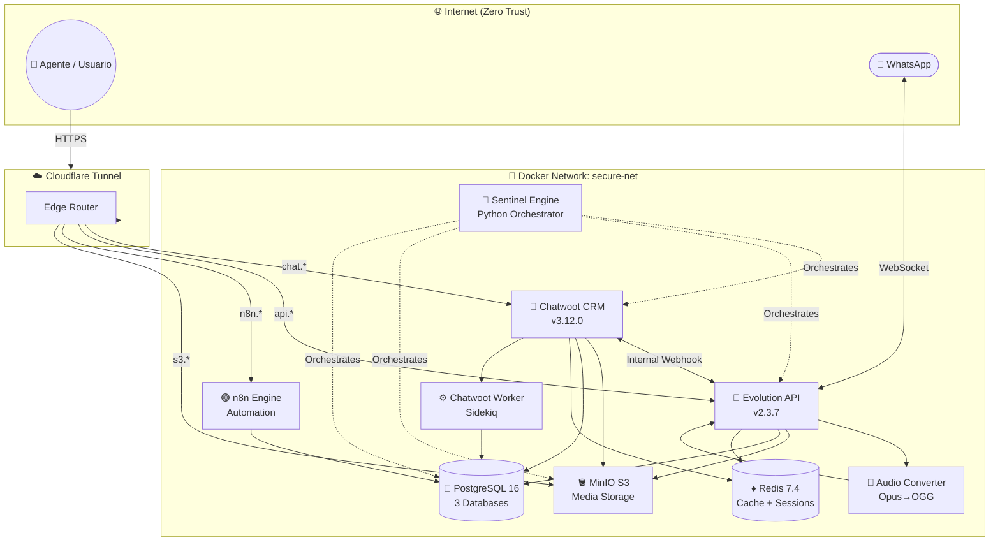

<div align="center">

```
███████╗███████╗███╗   ██╗████████╗██╗███╗   ██╗███████╗██╗      ██████╗ ███████╗
██╔════╝██╔════╝████╗  ██║╚══██╔══╝██║████╗  ██║██╔════╝██║     ██╔═══██╗██╔════╝
███████╗█████╗  ██╔██╗ ██║   ██║   ██║██╔██╗ ██║█████╗  ██║     ██║   ██║███████╗
╚════██║██╔══╝  ██║╚██╗██║   ██║   ██║██║╚██╗██║██╔══╝  ██║     ██║   ██║╚════██║
███████║███████╗██║ ╚████║   ██║   ██║██║ ╚████║███████╗███████╗╚██████╔╝███████║
╚══════╝╚══════╝╚═╝  ╚═══╝   ╚═╝   ╚═╝╚═╝  ╚═══╝╚══════╝╚══════╝ ╚═════╝ ╚══════╝
```

# 🌌 SENTINEL OS `v11.1` — *Nexus Release*
### The Ultimate Multi-Instance WhatsApp Orchestration Platform

<br/>

[](https://github.com/HackUN09/chatbot-stack/releases)
[](https://github.com/HackUN09/chatbot-stack)
[](https://www.docker.com/)
[](https://python.org)
[](LICENSE)

<br/>

> **"Un sistema de chatbot no debería requerir un ingeniero de guardia las 24 horas."**
>
> Sentinel OS automatiza lo que antes tomaba horas de configuración manual. Se despliega solo. Se repara solo. Escala solo.

<br/>

```
┌─────────────────────────────────────────────────────────────────┐
│   🔵 Evolution API  ←→  💬 Chatwoot CRM  ←→  🟣 n8n Engine     │
│              ↕                   ↕                  ↕           │
│         🪣 MinIO S3    ←→   🐘 PostgreSQL  ←→  ♦ Redis          │
│                          ↑                                       │
│              ☁️  Cloudflare Tunnel  (Zero-Trust)                 │
└─────────────────────────────────────────────────────────────────┘
```

</div>

---

## 📖 Tabla de Contenidos

| # | Sección |
|:-:|:--------|
| 1 | [🚀 ¿Qué es Sentinel OS?](#-qué-es-sentinel-os) |
| 2 | [🏗️ Arquitectura del Sistema](#️-arquitectura-del-sistema) |
| 3 | [⚡ Inicio Rápido](#-inicio-rápido) |
| 4 | [🧬 El Sentinel Engine](#-el-sentinel-engine) |
| 5 | [🔒 Modelo de Seguridad Zero-Trust](#-modelo-de-seguridad-zero-trust) |
| 6 | [🐛 Issues Críticos Resueltos](#-issues-críticos-resueltos) |
| 7 | [🎯 Acceso a Servicios](#-acceso-a-servicios) |
| 8 | [🔄 Tabla de Operaciones](#-tabla-de-operaciones) |
| 9 | [📚 Documentación](#-documentación) |
| 10 | [♻️ Guía de Réplica (Snapshot)](#️-guía-de-réplica-snapshot) |

---

## 🚀 ¿Qué es Sentinel OS?

**Sentinel OS** es una plataforma de orquestación de chatbots de grado producción. Actúa como el **Sistema Operativo** de tu infraestructura de mensajería, gestionando el ciclo de vida completo de las instancias de WhatsApp, sus integraciones con CRM y los flujos de automatización con IA.

### Lo que hace por ti:

| Capacidad | Descripción |
|:----------|:------------|
| 🤖 **Multi-Instancia** | Gestiona N instancias de WhatsApp desde un solo servidor |
| 🔗 **Bridge Automático** | Conecta Evolution API con Chatwoot sin configuración manual |
| 🎤 **Transcoding de Audio** | Convierte Opus → OGG en tiempo real para voz perfecta en el CRM |
| 🪣 **S3 Unificado** | MinIO centraliza todos los archivos multimedia en un solo bucket |
| 🔄 **Auto-Healing** | Detecta y repara fallos de integración automáticamente |
| ☁️ **Zero Exposure** | Cloudflare Tunnel: cero puertos abiertos al internet |
| 🧠 **IA-Ready** | n8n pre-configurado listo para conectar OpenAI, Gemini, o cualquier LLM |

---

## 🏗️ Arquitectura del Sistema

Sentinel OS opera como un **sistema dinámico acoplado** donde el equilibrio de estado es mantenido activamente por el **Sentinel Engine**.


```mermaid
graph TD
    subgraph INTERNET["🌐 Internet (Zero Trust)"]
        USR((👤 Agente / Usuario))
        WA([📱 WhatsApp])
    end

    subgraph CF["☁️ Cloudflare Tunnel"]
        EDGE[Edge Router]
    end

    subgraph DOCKER["🐳 Docker Network: secure-net"]
        CW[💬 Chatwoot CRM<br/>v3.12.0]
        CWW[⚙️ Chatwoot Worker<br/>Sidekiq]
        EVO[🔵 Evolution API<br/>v2.3.7]
        AC[🎤 Audio Converter<br/>Opus→OGG]
        N8N[🟣 n8n Engine<br/>Automation]
        MIN[🪣 MinIO S3<br/>Media Storage]
        DB[(🐘 PostgreSQL 16<br/>3 Databases)]
        RD[(♦️ Redis 7.4<br/>Cache + Sessions)]
        SE[🧬 Sentinel Engine<br/>Python Orchestrator]
    end

    USR -->|HTTPS| CF
    WA <-->|WebSocket| EVO
    CF --> EDGE
    EDGE -->|chat.*| CW
    EDGE -->|api.*| EVO
    EDGE -->|n8n.*| N8N
    EDGE -->|s3.*| MIN

    CW <-->|Internal Webhook| EVO
    EVO --> AC
    AC --> EVO
    CW & EVO --> MIN
    CW & EVO & N8N --> DB
    CW & EVO --> RD
    CW --> CWW
    CWW --> DB

    SE -.->|Orchestrates| CW
    SE -.->|Orchestrates| EVO
    SE -.->|Orchestrates| MIN
    SE -.->|Orchestrates| DB
```

### Stack de Servicios

| Servicio | Imagen | Rol | Recursos |
|:---------|:-------|:----|:---------|
| **Chatwoot Web** | `chatwoot/chatwoot:v3.12.0` | CRM Frontend + API | 1.5 CPU / 2GB RAM |
| **Chatwoot Worker** | `chatwoot/chatwoot:v3.12.0` | Sidekiq Background Jobs | 1.5 CPU / 1.5GB RAM |
| **Evolution API** | `evoapicloud/evolution-api:v2.3.7` | WhatsApp Bridge | 2.0 CPU / 2GB RAM |
| **Audio Converter** | `atendai/evolution-audio-converter` | Transcoding Opus→OGG | Mínimo |
| **n8n** | `docker.n8n.io/n8nio/n8n:latest` | Automation Engine | 1.0 CPU / 1GB RAM |
| **PostgreSQL** | `postgres:16` | Base de Datos Principal | — |
| **Redis** | `redis:7.4` | Cache + Cola de Trabajo | — |
| **MinIO** | `minio/minio` | S3 Object Storage | — |
| **Cloudflare** | `cloudflare/cloudflared` | Secure Tunnel | — |

---

## ⚡ Inicio Rápido

### Prerequisitos

```bash
# Verificar Docker instalado (v24.0+)
docker --version

# Verificar Docker Compose (v2.0+)
docker compose version

# Python 3.10+ (para Sentinel Engine)
python --version
```

### Despliegue en 3 Pasos

```bash
# ── PASO 1: Clonar el repositorio ─────────────────────────────────────
git clone https://github.com/HackUN09/chatbot-stack.git
cd chatbot-stack

# ── PASO 2: Configurar variables de entorno ────────────────────────────
cp .env.example .env

# Edita las 6 variables esenciales marcadas con ★ en el archivo .env:
# ★ DOMAIN, CLOUDFLARE_TUNNEL_TOKEN, CHATWOOT_ADMIN_EMAIL,
# ★ CHATWOOT_ADMIN_PASSWORD, EVOLUTION_API_KEY, POSTGRES_ROOT_PASSWORD
nano .env   # (o tu editor preferido)

# ── PASO 3: Encender el sistema ────────────────────────────────────────
chmod +x sistema_maestro.sh
./sistema_maestro.sh
# → Seleccionar Opción 1: 🚀 GENESIS (Primer Despliegue)
```

> ⏱️ **Tiempo estimado de despliegue:** 3–5 minutos en primer arranque (migraciones de DB incluidas).

---

## 🧬 El Sentinel Engine

El corazón del sistema. Un orquestador Python que mantiene el estado de equilibrio entre todos los servicios.

```
ops/scripts/sentinel_engine.py
```

### Comandos Disponibles

```bash
# ── SINCRONIZACIÓN ─────────────────────────────────────────────────────
# Detecta instancias de WhatsApp y las conecta automáticamente a Chatwoot
# También parchea los webhooks a URLs internas (elimina hairpinning)
python ops/scripts/sentinel_engine.py --fix-evo

# ── SALUD DEL SISTEMA ──────────────────────────────────────────────────
# Espera activamente hasta que TODOS los servicios respondan HTTP 200
python ops/scripts/sentinel_engine.py --wait

# ── BASE DE DATOS ──────────────────────────────────────────────────────
# Garantiza usuarios, permisos y roles en PostgreSQL
python ops/scripts/sentinel_engine.py --fix-db

# Ejecuta migraciones de Chatwoot si las tablas no existen
python ops/scripts/sentinel_engine.py --prep-cw

# Inicializa admin y token de Chatwoot (first boot)
python ops/scripts/sentinel_engine.py --setup-cw

# ── ALMACENAMIENTO S3 ──────────────────────────────────────────────────
# Crea buckets en MinIO y aplica políticas de acceso público
python ops/scripts/sentinel_engine.py --setup-s3

# Corrige Content-Type y Content-Disposition de audios .opus en MinIO
python ops/scripts/sentinel_engine.py --heal-media

# ── UTILIDADES ─────────────────────────────────────────────────────────
# Leer una variable del .env desde la terminal
python ops/scripts/sentinel_engine.py --get EVOLUTION_API_KEY
```

### Flujo de Automatización (GENESIS)

```
Sistema Maestro (Bash)
        │
        ├─ 1. Levanta infra (Postgres, Redis, MinIO, Cloudflare)
        ├─ 2. Levanta apps (Chatwoot, Evolution, n8n)
        │
        └─ Sentinel Engine (Python)
                │
                ├─ --wait        → Espera salud de todos los servicios
                ├─ --fix-db      → Garantiza usuarios en Postgres
                ├─ --prep-cw     → Migra tablas de Chatwoot si es necesario
                ├─ --setup-cw    → Crea admin + inyecta token en .env
                ├─ --setup-s3    → Configura buckets MinIO + políticas
                └─ --fix-evo     → Sincroniza Evolution ↔ Chatwoot + Parchea webhooks
```

---

## 🔒 Modelo de Seguridad Zero-Trust

```
╔══════════════════════════════════════════════════════════════════╗
║  🌐  I N T E R N E T                                            ║
║  ┌──────────────────────────────────────────────────────────┐   ║
║  │  ☁️  CLOUDFLARE EDGE  (TLS 1.3, Zero Trust)              │   ║
║  │  ┌────────────────────────────────────────────────────┐  │   ║
║  │  │  🐳  DOCKER NETWORK: secure-net (bridge aislado)   │  │   ║
║  │  │                                                    │  │   ║
║  │  │   PostgreSQL ── sin port binding externo           │  │   ║
║  │  │   Redis      ── password + solo red interna        │  │   ║
║  │  │   MinIO      ── 127.0.0.1:9000 (solo localhost)    │  │   ║
║  │  │   Chatwoot   ── 127.0.0.1:3000 (solo localhost)    │  │   ║
║  │  │   Evolution  ── 127.0.0.1:8080 (solo localhost)    │  │   ║
║  │  │   .env       ── blindado por .gitignore            │  │   ║
║  │  └────────────────────────────────────────────────────┘  │   ║
║  └──────────────────────────────────────────────────────────┘   ║
╚══════════════════════════════════════════════════════════════════╝
```

### Medidas de Seguridad Activas

| # | Medida | Estado |
|:-:|:-------|:------:|
| 1 | **0 puertos expuestos** al internet (todo vía Cloudflare Tunnel) | ✅ |
| 2 | **Red Docker aislada** (`secure-net`) — servicios solo se ven entre sí | ✅ |
| 3 | **Credenciales segregadas** — cada servicio tiene su propio usuario DB | ✅ |
| 4 | **Healthchecks** en todos los servicios con `restart: always` | ✅ |
| 5 | **`.gitignore` blindado** — `.env`, `.env.bank`, `persistence/`, `logs/` nunca a GitHub | ✅ |
| 6 | **SSRF Hardening** — whitelist de servicios internos en Chatwoot | ✅ |
| 7 | **S3 CDN Reference** — archivos referenciados por URL pública, no IP interna | ✅ |
| 8 | **Webhook Interno** — comunicación Evolution↔Chatwoot sin salir a internet | ✅ |

---

## 🐛 Issues Críticos Resueltos

Esta sección documenta problemas de producción reales encontrados y resueltos durante el desarrollo. Es parte del ADN de este proyecto.

---

### 🔴 `Issue #1` — Chatwoot bloqueaba media de Evolution API
**Error:** `HTTP 422 Unprocessable Content — Invalid Hostname`
**Severidad:** Crítica — Ninguna imagen ni audio de WhatsApp llegaba al CRM.

**Causa Raíz:**
Chatwoot (Rails) implementa protección SSRF que bloquea peticiones HTTP a hostnames internos de Docker como `core_minio`. Cuando Evolution enviaba `http://core_minio:9000/...` como URL de archivo, Chatwoot lo rechazaba.

**Solución implementada:**
```yaml
# En docker-compose.yml (Chatwoot)
SSRF_SAFE_LIST: "core_minio,chatwoot-web,evolution_audio_converter,app_evolution"

# En Evolution API
S3_PUBLIC_URL: https://s3.${DOMAIN}  # URL pública del CDN, no la interna
```

---

### 🔴 `Issue #2` — Timeout de 30s en webhooks (Hairpinning)
**Error:** `chatwoot-worker: Timed out reading data from server`
**Severidad:** Crítica — Mensajes de WhatsApp con delay de 30s o pérdida total.

**Causa Raíz:**
El webhook de Chatwoot apuntaba a `https://api.tudominio.com`. Cada evento salía de Docker → Cloudflare → Internet → Cloudflare → Docker. Round-trip innecesario de ~30s que terminaba en timeout.

**Solución implementada:**
```python
# sentinel_engine.py — patch_webhook_internal()
# Parchea automáticamente la URL del webhook en cada sincronización:
internal_url = f"http://app_evolution:8080/chatwoot/webhook/{instance_name}"
# El tráfico nunca sale del servidor. Latencia: <1ms.
```

---

### 🟡 `Issue #3` — DNS interno inconsistente
**Error:** `ECONNREFUSED — http://minio-core:9000`
**Causa:** El nombre en `.env` era `minio-core` pero el `container_name` real en Docker era `core_minio`.
**Solución:** Unificado a `core_minio` en 7 archivos del proyecto.

---

### 🟡 `Issue #4` — QR Code de WhatsApp no aparece
**Error:** Timeout en `/instance/connect` de Evolution API.
**Causa:** Versión de WhatsApp Web obsoleta en Baileys (motor de Evolution).
**Solución:**
```env
CONFIG_SESSION_PHONE_VERSION=2.3000.1033351060
```

---

### 🟡 `Issue #5` — UnicodeEncodeError en Windows
**Error:** `charmap codec can't encode character '\u2605'`
**Causa:** Windows usa `cp1252` por defecto. El `.env` tiene emojis y caracteres UTF-8.
**Solución:** `encoding='utf-8'` forzado en todos los `open()` del Sentinel Engine + fallback multi-encoding en `load_env()`.

---

### 🟡 `Issue #6` — Chatwoot 502 durante el primer boot
**Síntoma:** Cloudflare devuelve `502 Bad Gateway` los primeros 2-3 minutos.
**Causa:** `db:prepare` migra ~200 tablas antes de que Puma (el servidor web) empiece a escuchar.
**Solución:** Comportamiento esperado y documentado. `sentinel_engine.py --wait` espera activamente el HTTP 200 antes de proceder con la configuración.

---

## 🎯 Acceso a Servicios

| Servicio | URL de Acceso | Credenciales |
|:---------|:-------------|:-------------|
| 💬 **Chatwoot CRM** | `https://chat.tudominio.com` | `CHATWOOT_ADMIN_EMAIL` + `CHATWOOT_ADMIN_PASSWORD` |
| 🔵 **Evolution API** | `https://api.tudominio.com` | Header: `apikey: EVOLUTION_API_KEY` |
| 🟣 **n8n Automation** | `https://n8n.tudominio.com` | Se define en el primer acceso web |
| 🪣 **MinIO Console** | `http://localhost:9001` | `MINIO_ROOT_USER` / `MINIO_ROOT_PASSWORD` |
| 🐘 **PgAdmin** | `http://localhost:5050` | `PGADMIN_DEFAULT_EMAIL` / `PGADMIN_DEFAULT_PASSWORD` |
| ♦️ **Redis Insight** | `http://localhost:5540` | Sin contraseña (acceso solo local) |

> 💡 Los accesos en `localhost:PORT` son exclusivamente locales y **nunca se exponen a internet**.

---

## 🔄 Tabla de Operaciones

| Operación | Comando | Frecuencia Recomendada |
|:----------|:--------|:----------------------|
| 🔄 **Actualizar stack** | `git pull && ./sistema_maestro.sh → Opción 4` | Semanal |
| 💾 **Backup completo** | `tar -czf backup-$(date +%Y%m%d).tar.gz persistence/` | Diario |
| 📊 **Ver logs en vivo** | `docker compose -p 02-apps logs -f` | Ad-hoc |
| 🔬 **Health check global** | `docker ps --format "table {{.Names}}\t{{.Status}}"` | Ad-hoc |
| 🔁 **Re-sincronizar WhatsApp** | `python ops/scripts/sentinel_engine.py --fix-evo` | Tras reinicio |
| 🧹 **Limpieza Docker** | `./ops/scripts/clean-docker.sh` | Mensual |
| 🎤 **Fix audio metadata** | `python ops/scripts/fix_media_metadata.py` | Si hay audios con error |
| 🪣 **Fix S3 MIME types** | `python ops/scripts/sentinel_engine.py --heal-media` | Tras migración de datos |
| 🛑 **Apagar todo** | `./sistema_maestro.sh → Opción 5` | Ad-hoc |

---

## 📚 Documentación

| Documento | Descripción |
|:----------|:------------|
| 📘 [**Manual de Instalación**](ops/docs/MANUAL_INSTALACION.md) | Guía completa desde cero con troubleshooting |
| ⚙️ [**Mapa de Configuración**](ops/docs/CONFIGURACION_MANUAL.md) | Referencia de las 45+ variables de entorno |
| 🛡️ [**Arquitectura de Seguridad**](ops/docs/SECURITY.md) | Deep dive en Zero-Trust y SSRF Hardening |
| 📋 [**Guía de Réplica**](ops/docs/GUIA_REPLICA.md) | Checklist para replicar el sistema en un nuevo servidor |
| 🔬 [**Ejemplos n8n**](ops/docs/examples/) | Flujos de automatización listos para importar |

---

## ♻️ Guía de Réplica (Snapshot)

Esta sección es tu **garantía de portabilidad**. Si necesitas mover el sistema a otro servidor, aquí está el proceso.

```bash
# ── EN EL SERVIDOR ORIGINAL ───────────────────────────────────────────
# 1. Hacer backup de la persistencia
tar -czf sentinel-backup-$(date +%Y%m%d).tar.gz persistence/ .env

# 2. Transferir al nuevo servidor
scp sentinel-backup-*.tar.gz usuario@nuevo-servidor:/opt/chatbot-stack/

# ── EN EL SERVIDOR NUEVO ──────────────────────────────────────────────
# 3. Clonar el repositorio
git clone https://github.com/HackUN09/chatbot-stack.git /opt/chatbot-stack
cd /opt/chatbot-stack

# 4. Restaurar datos y configuración
tar -xzf sentinel-backup-*.tar.gz

# 5. Actualizar DOMAIN y CLOUDFLARE_TUNNEL_TOKEN en .env
nano .env

# 6. Desplegar
chmod +x sistema_maestro.sh && ./sistema_maestro.sh
# → Opción 1: GENESIS
```

> ✅ **Todos tus datos de WhatsApp, conversaciones y configuraciones estarán intactos.**

### Variables Mínimas para Réplica

Las únicas variables que **siempre cambian** entre servidores:

| Variable | Descripción |
|:---------|:------------|
| `DOMAIN` | Tu dominio (sin `https://`) |
| `CLOUDFLARE_TUNNEL_TOKEN` | Token del tunnel de Cloudflare para ese dominio |

El resto puede mantenerse igual entre réplicas.

---

<div align="center">

---

### 🛟 ¿Problemas? ¿Ideas? ¿Mejoras?

Abre un [**Issue en GitHub**](https://github.com/HackUN09/chatbot-stack/issues) — Respondemos rápido.

---

<br/>

```
   _____ ______ _   _ _______ _____ _   _ ______ _        ____   _____
  / ____|  ____| \ | |__   __|_   _| \ | |  ____| |      / __ \ / ____|
 | (___ | |__  |  \| |  | |    | | |  \| | |__  | |     | |  | | (___
  \___ \|  __| | . ` |  | |    | | | . ` |  __| | |     | |  | |\___ \
  ____) | |____| |\  |  | |   _| |_| |\  | |____| |____ | |__| |____) |
 |_____/|______|_| \_|  |_|  |_____|_| \_|______|______| \____/|_____/
```

*Construido con principios de **Sistemas Dinámicos**, **Arquitectura de Microservicios** y **Zero-Trust Security***

**Desarrollado con 🧬 por [HackUN09](https://github.com/HackUN09) & Antigravity AI**

[](https://github.com/HackUN09/chatbot-stack/stargazers)
[](https://www.docker.com/)
[](https://github.com/EvolutionAPI/evolution-api)

📜 **Licencia MIT** — Libre para uso comercial y personal

</div>
