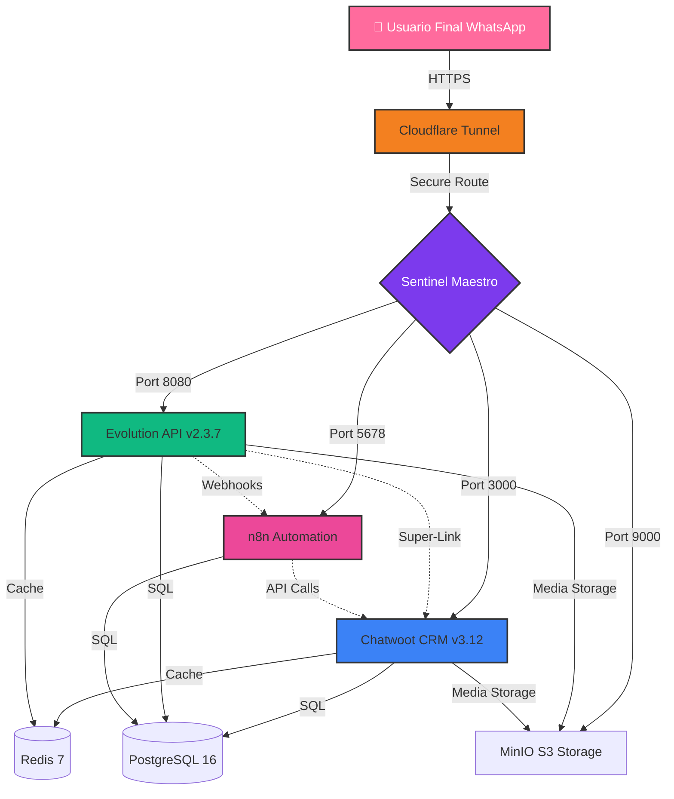

# 🌌 Sentinel OS v11.0 | Isekai Stack
> **Infraestructura conversacional empresarial autoreparable**  
> Chatwoot CRM + Evolution API + n8n + MinIO S3 = Omnicanalidad absoluta

[](https://github.com/HackUN09/chatbot-stack)
[](https://chat.isekaichat.com)
[](LICENSE)
[](https://www.docker.com/)

---

## 🎯 ¿Qué es Sentinel OS?

**Sentinel OS** no es solo un conjunto de Docker containers. Es un **ecosistema autosuficiente, autoreparable y modular** diseñado para:

- ✅ Gestionar conversaciones de **WhatsApp Business** a escala empresarial
- ✅ Centralizar atención al cliente en un solo CRM (Chatwoot)
- ✅ Automatizar respuestas y workflows con IA (n8n)
- ✅ Almacenar multimedia deduplicada en S3 (MinIO)
- ✅ Mantener seguridad **Zero-Trust** con Cloudflare Tunnel

---

## 🛠️ Stack Tecnológico

| Servicio | Versión | Propósito | Puerto |
|:---------|:--------|:----------|:-------|
| **Chatwoot** | v3.12.0 | CRM & Live Chat | 3000 |
| **Evolution API** | v2.3.7 | Gateway WhatsApp | 8080 |
| **n8n** | v1.76.1 | Automatización de workflows | 5678 |
| **PostgreSQL** | 16.6-alpine | Base de datos relacional | 5432 |
| **Redis** | 7.4-alpine | Cache & Queue | 6379 |
| **MinIO** | latest | S3-compatible storage | 9000 |
| **Cloudflare Tunnel** | latest | Proxy seguro Zero-Trust | - |

---

## 🏗️ Arquitectura del Sistema


```mermaid
graph TD
    A[👤 Usuario Final WhatsApp] -->|HTTPS| B[Cloudflare Tunnel]
    B -->|Secure Route| C{Sentinel Maestro}
    
    C -->|Port 8080| D[Evolution API v2.3.7]
    C -->|Port 3000| E[Chatwoot CRM v3.12]
    C -->|Port 5678| F[n8n Automation]
    C -->|Port 9000| G[MinIO S3 Storage]
    
    D -.->|Super-Link| E
    D -.->|Webhooks| F
    F -.->|API Calls| E
    
    E -->|SQL| H[(PostgreSQL 16)]
    D -->|SQL| H
    F -->|SQL| H
    
    E -->|Cache| I[(Redis 7)]
    D -->|Cache| I
    
    D -->|Media Storage| G
    E -->|Media Storage| G
    
    style A fill:#ff6b9d,stroke:#333,stroke-width:2px,color:#fff
    style B fill:#f38020,stroke:#333,stroke-width:2px
    style C fill:#7c3aed,stroke:#333,stroke-width:2px,color:#fff
    style D fill:#10b981,stroke:#333,stroke-width:2px
    style E fill:#3b82f6,stroke:#333,stroke-width:2px
    style F fill:#ec4899,stroke:#333,stroke-width:2px
```

---

## ⚡ Quick Start

### 1. Clonar el Repositorio

```bash
git clone https://github.com/HackUN09/chatbot-stack.git
cd chatbot-stack
```

### 2. Configurar Secretos

```bash
cp .env.example .env
nano .env  # Configura tu dominio y credenciales
```

### 3. Desplegar Todo el Sistema

```bash
./sistema_maestro.sh
```

Selecciona **Opción 1: DEPLOY STACK** y espera 3-5 minutos.

### 4. Acceder a los Servicios

| Servicio | URL | Credenciales |
|:---------|:----|:-------------|
| 💬 **Chatwoot** | `https://chat.tudominio.com` | Creadas en primer acceso |
| 🤖 **Evolution API** | `https://api.tudominio.com` | API Key del `.env` |
| ⚙️ **n8n** | `https://n8n.tudominio.com` | Email/Password del `.env` |
| 🪣 **MinIO** | `https://s3.tudominio.com` | minioadmin / Password del `.env` |

---

## 📚 Documentación Completa

- **[📘 Manual de Instalación](ops/docs/MANUAL_INSTALACION.md)** - Guía paso a paso desde cero
- **[🔧 Configuración Manual](ops/docs/CONFIGURACION_MANUAL.md)** - Configuración avanzada de cada servicio
- **[🛡️ Protocolo Aegis](ops/docs/protocolo_aegis_v11.md)** - Auto-curado y resiliencia
- **[🏛️ Flujo Arquitectónico](ops/docs/flujo_arquitectonico_sentinel.md)** - Topología de datos
- **[🔬 Auditoría Arquitectónica](ops/docs/auditoria_arquitectonica_v11.md)** - Análisis técnico

---

## 📦 Estructura del Proyecto

```
chatbot-stack/
├── 📂 modules/              # Definiciones Docker Compose
│   ├── 01-infra/            # PostgreSQL, Redis, MinIO
│   ├── 02-apps/             # Chatwoot, Evolution, n8n
│   └── 03-tunnel/           # Cloudflare Tunnel
├── 📂 ops/                  # Centro de operaciones
│   ├── docs/                # Documentación técnica
│   ├── scripts/             # Scripts de mantenimiento
│   └── backups/             # Backups automáticos
├── 📂 persistence/          # Datos persistentes (volúmenes)
├── 🔧 .env                  # Variables de entorno (NO subir a Git)
├── 🚀 sistema_maestro.sh    # Orquestador principal
└── 📖 README.md             # Este archivo
```

---

## 🩺 Troubleshooting

### Chatwoot no carga
```bash
docker logs chatwoot-web --tail 100
# Espera: "Listening on http://0.0.0.0:3000"
```

### Evolution API: QR no aparece
```bash
docker logs app_evolution | grep -i "qr"
# Ya configurado con WhatsApp Web v2.3000.1033351060
```

### n8n no conecta / credenciales inválidas
```bash
docker logs app_n8n_editor --tail 50
# El primer usuario se crea en el primer acceso a https://n8n.tudominio.com
```

### Multimedia: Imágenes o stickers no se muestran en Chatwoot
✅ **El sistema ahora configura automáticamente los buckets S3 con acceso público.**  
Ejecuta la opción 4 (REPAIR & SYNC) para re-aplicar:
```bash
./sistema_maestro.sh
# → Opción 4: REPAIR & SYNC
```
O verifica manualmente:
```bash
# MinIO debe estar healthy
docker ps | grep minio-core  # → (healthy)
# Verificar buckets con política pública
docker exec minio-core mc anonymous get local/evolution-media
docker exec minio-core mc anonymous get local/chatwoot-storage
```

---

## 🔒 Seguridad

- ✅ **Zero-Trust Access** vía Cloudflare Tunnel (No abre puertos en el router)
- ✅ **.gitignore** configurado para proteger `.env` y `.env.bank`  
- ✅ **Redis protegido** con password obligatorio
- ✅ **PostgreSQL** solo accesible desde red interna Docker
- ✅ **Healthchecks** activos para auto-recuperación

---

## 🛟 Soporte y Comunidad

¿Problemas? ¿Sugerencias? Abre un [Issue en GitHub](https://github.com/HackUN09/chatbot-stack/issues)

---

## 📜 Licencia

Este proyecto está bajo la licencia **MIT**. Consulta el archivo [LICENSE](LICENSE) para más detalles.

---

<div align="center">

**Desarrollado con 💖 por [HackUN09](https://github.com/HackUN09) & Antigravity AI**

[](https://github.com/HackUN09)

</div>
