<div align="center">

# ⛩️ ISEKAI STACK (SENTINEL OS)
### Enterprise AI Chatbot Infrastructure v11.0 [GOLD MASTER]

[]()
[]()
[]()
[]()

*The "Zero-Touch" Infrastructure for Evolution API, Chatwoot, and n8n.*

[🚀 Quick Start](#-quick-start) • [🏗 Architecture](#-architecture) • [🔧 Configuration](#-configuration) • [🩺 Diagnostics](#-diagnostics-sentinel-hud)

</div>

---

## 📖 Overview

**Isekai Stack** is a production-ready, highly automated infrastructure designed to deploy and manage a complete conversational AI ecosystem. Built with a "Zero-Touch" philosophy, it includes self-healing capabilities, automated integrity checks, and a gamified command center known as **Sentinel OS**.

### 🧩 Core Components
*   **Evolution API v2**: The heart of WhatsApp connectivity.
*   **Chatwoot (Super-Linked)**: Omnichannel customer support platform, automatically provisioned.
*   **n8n**: Workflow automation engine for AI logic.
*   **Postgres & Redis**: High-performance persistence and caching layer.
*   **Cloudflare Tunnel**: Secure, zero-config global access.

---

## 🏗 Architecture

```mermaid
graph TD
    user((User / WA)) -->|HTTPS| cloudflare[Cloudflare Tunnel]
    cloudflare -->|Secure Net| nginx[Reverse Proxy / Apps]
    
    subgraph "Isekai Stack (Docker)"
        evolution[Evolution API]
        chatwoot[Chatwoot Web/Worker]
        n8n[n8n Automation]
        
        sentinel[🛡️ Sentinel OS Monitor]
        
        db[(Postgres Core)]
        redis[(Redis Cache)]
        minio[(MinIO Storage)]
        
        evolution <-->|Auto-Link| chatwoot
        evolution -->|Events| n8n
        sentinel -->|Heals| evolution
        
        chatwoot --> db & redis & minio
        evolution --> db & redis & minio
        n8n --> db
    end
```



---

## 🚀 Quick Start

### Prerequisites
*   Docker & Docker Compose
*   Python 3.9+
*   Git

### Installation (Zero-Touch)

1.  **Clone the Repository**
    ```bash
    git clone https://github.com/HackUN09/chatbot-stack.git
    cd chatbot-stack
    ```

2.  **Configure Environment**
    Copy the template and fill in your secrets.
    ```bash
    cp ops/config/envs/.env.example .env
    # Edit .env with your domains and passwords
    ```

3.  **Launch Sentinel OS**
    The system includes a Master Script that handles everything.
    ```bash
    ./sistema_maestro.sh
    ```
    *Select **Option 1 (Lanzar Sistema Completo)**.*

---

## 🔧 Configuration

The configuration is modularized for better maintainability:

| File | Location | Purpose |
| :--- | :--- | :--- |
| **`.env`** | `root` | **Master Configuration**. Controls all passwords, domains, and global keys. |
| `internal_evo.env` | `ops/config/envs/` | Advanced settings for Evolution API. |
| `internal_cw.env` | `ops/config/envs/` | Reference config for Chatwoot. |
| `internal_n8n.env` | `ops/config/envs/` | Reference config for n8n. |

---

## 🩺 Diagnostics (Sentinel HUD)

Sentinel OS includes a real-time HUD (Heads-Up Display) for system management.


### Key Features
*   **Auto-Healing**: Automatically detects and fixes 401 Unauthorized errors in Evolution API (`sentinel_fixer.py`).
*   **Smart Provisioning**: Creating an Evolution instance automatically configures the inbox in Chatwoot using internal API calls.
*   **Vault**: A secure view of your generated credentials.
*   **Genesis Snapshot**: One-click backups of code and database dumps.

### Useful Commands

```bash
# Verify System Integrity
python ops/scripts/sentinel_fixer.py --silent

# Reconstruct corrupted .env
python ops/scripts/env_reconstructor.py
```

---

## 📂 Project Structure

```text
/
├── .env                  # Master Secrets (GitIgnored)
├── sistema_maestro.sh    # Sentinel OS Controller
├── modules/              # Docker Compose Definitions
│   ├── 01-infra/        # Databases & Storage
│   ├── 02-apps/         # Main Applications
│   └── 03-tunnel/       # Networking
└── ops/                  # Operations Center
    ├── config/envs/     # Configuration Templates
    ├── scripts/         # Python Automation Scripts
    └── docs/            # Detailed Documentation
```

---

## 👤 Author

**HackUN09**
*   Email: wamr1991.1@gmail.com
*   Role: Systems Architect & Sentinel OS Developer

---

*Verified by Sentinel Hyper-Integrity Protocol v11.0*
