# ⚡ Sentinel OS v11.0: Arquitectura Enterprise 🚀


> **"Sencillez Absoluta. Potencia de Precisión. Autoridad Visual."**
>
> 💎 **Estándar:** Arquitectura Empresarial | 📈 Escalabilidad | 🛡️ Fiabilidad

---

## 🏗️ Arquitectura del Sistema

**Sentinel OS v11.0** ofrece un entorno robusto y contenerizado para la orquestación de flujos de chatbot complejos. Se basa en una pila probada de microservicios diseñados para **alta concurrencia** e **integridad de datos**.

### 🧩 Diagrama de Componentes

```mermaid
graph TD
    User([🚦 Tráfico de Usuario]) -->|HTTPS| CF[☁️ Túnel Cloudflare]
    CF -->|Router| API[🚀 Evolution API v2]
    
    subgraph "Infraestructura Core"
        API -->|Hilos de Chat| PG[(🐘 PostgreSQL 15)]
        API -->|Cola de Trabajos| RD[(🧠 Redis Cache)]
        API -->|Almacenamiento Multimedia| S3[(📦 MinIO Object Storage)]
    end
    
    subgraph "Lógica de Negocio"
        API -->|Webhooks| N8N[🔗 Motor de Flujos n8n]
        N8N -->|Sincronización CRM| CW[💬 Chatwoot CRM]
        CW -->|Worker Pool| RD
    end
```


---

## 🚀 Características Clave

| 🌟 Característica | 📝 Descripción | ⚡ Métrica de Rendimiento |
| :--- | :--- | :--- |
| **🏎️ Alta Concurrencia** | Pooling de Conexiones Optimizado (PgBouncer) | Soporta **500+ conexiones activas** |
| **📦 Almacenamiento Soberano** | Object Storage auto-hospedado vía MinIO | **Cero restricciones** en tamaño de archivos |
| **⚖️ Balanceo de Carga** | Tuning de Sidekiq Workers | **50 Hilos Concurrentes** para Chatwoot |
| **📡 Monitoreo Inteligente** | Hub de Recursos en Tiempo Real | Rastreo de Latencia **sub-10ms** |
| **🔐 Seguridad Primero** | Gestión de Credenciales tipo Bóveda | Visualización **encriptada** |

---

## 🛠️ Guía de Uso

### 1. 🎛️ El Centro de Control (Sistema Maestro)
El sistema se gestiona a través de la terminal interactiva `sistema_maestro.sh`.
```bash
./sistema_maestro.sh
```

### 2. 📋 Opciones del Menú Principal
- **⚡ 1. Iniciar/Reiniciar:** Inicia la secuencia de arranque completa con auto-diagnóstico.
- **📡 3. Monitor de Recursos:** Dashboard en tiempo real de uso de CPU/RAM de todos los contenedores.
- **🔍 4. Auditor de Logs:** Streaming en vivo de logs para depurar el flujo de la aplicación.
- **🔐 5. Bóveda del Sistema:** Visualiza de forma segura todas las API Keys, Contraseñas y Puntos de Acceso.

---

## 📦 Instalación y Despliegue

### 📋 Prerrequisitos
- 🐳 Docker & Docker Compose
- 🐍 Python 3.9+
- 🐙 Git

### ⚡ Inicio Rápido
1.  **Clonar Repositorio:**
    ```bash
    git clone <repo_url>
    cd chatbot-stack
    ```
2.  **Configuración de Entorno:**
    Asegúrate de que el archivo `.env` esté poblado con credenciales válidas (ver `env.example`).
3.  **Lanzamiento:**
    Ejecuta `./sistema_maestro.sh` y selecciona la **Opción 1**.

---

## 📜 Verificación de Integridad
Esta versión (**v11.0**) ha sido auditada contra el **Protocolo de Rigor Empresarial**, asegurando:

- ✅ **Repositorio Limpio:** Cero archivos de respaldo innecesarios o temporales.
- ✅ **Configuración Segura:** Patrones estrictos en `.gitignore`.
- ✅ **Rendimiento Optimizado:** Workers y caché pre-ajustados.

---
