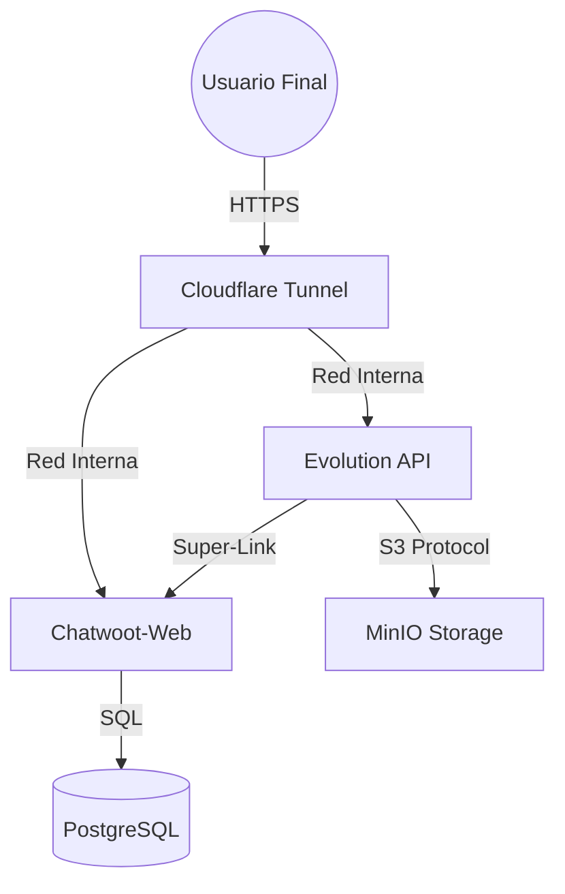

# 📖 Guía del Sistema Sentinel OS (Gold Master v11.0)

Esta guía técnica detalla el funcionamiento interno de tu infraestructura blindada.

## 🕹️ Arquitectura de Orquestación (Súper-Link)

El sistema opera en una jerarquía de capas aisladas bajo la red interna `secure-net`:
1.  **Capa 01 (Infra):** PostgreSQL 15, Redis 7 y MinIO. Esta capa provee la persistencia de datos.
2.  **Capa 02 (Apps):** Chatwoot, Evolution API (Sentinel-V9) y n8n. Es el motor de ejecución.
3.  **Capa 03 (Tunnel):** Cloudflare Tunnel. Provee acceso seguro (Zero-Trust) sin exponer puertos al router.

---

## 🔬 Componentes Clave y Lógica Interna

### 1. `sistema_maestro.sh` (El Orquestador v11.0)
No es un simple script de arranque; es un vigilante de estado que ejecuta el **Protocolo Génesis**:
1.  **Validación de Entorno:** Verifica la existencia de `.env` y carga las variables.
2.  **Sanitación Previa:** Lanza `sentinel_fixer.py --silent` para limpiar el `.env` antes de que Docker lo lea.
3.  **Despliegue Secuencial:** Levanta las capas 01 y 02 en orden, asegurando que las bases de datos estén listas.
4.  **Detección de 401:** Realiza una petición `curl` interna a Evolution. Si detecta un error de autenticación, ejecuta un `--force-recreate` automático.
5.  **Vinculación Súper-Link:** Activa el puente entre Evolution y Chatwoot sin intervención humana.

### 2. `ops/scripts/sentinel_fixer.py` (Sentinel Brain v11.0)
El motor de auto-curación ("God Mode") especializado en la integridad de datos:
-   **🛡️ Escudo Anti-Corrupción:** Verifica la integridad estructural del `.env` antes de cada lectura. Si detecta corrupción (código binario/basura), restaura automáticamente desde el último backup (`.env.bak`) o alerta al usuario.
-   **Sanitización Quirúrgica:** Lee el `.env` en modo seguro, elimina bytes nulos y caracteres invisibles.
-   **Sincronización de Llaves:** Sincroniza automáticamente `EVOLUTION_API_KEY` con `VITE_EVOLUTION_API_KEY`.
-   **Glaseado Automático (Super-Link):** 
    -   Obtiene el `CHATWOOT_GLOBAL_TOKEN` y el `ACCOUNT_ID` del `.env`.
    -   Para cada instancia de WhatsApp en Evolution, inyecta la configuración de Chatwoot mediante la API interna.
    -   Esto asegura que los mensajes fluyan hacia Chatwoot sin configurar nada en el Dashboard.
-   **Mantenimiento de PIDs:** Limpia archivos zombis de Chatwoot que impiden el arranque después de un fallo eléctrico.

---

## 🌐 Flujo de Datos Seguro

## 🛠️ Procedimientos Paso a Paso

### ¿Cómo añadir una nueva instancia de WhatsApp?
1.  Accede al Manager de Evolution API.
2.  Crea la instancia y escanea el QR.
3.  **Sentinel OS hará el resto:** En cuanto reinicies o ejecutes la **Opción 5(F)** del menú, Sentinel detectará la nueva instancia y la vinculará automáticamente a tu Chatwoot Cuenta 2.

### ¿Qué hacer ante un error 401 persistente?
1.  Ejecuta la **Opción 5** y elige **'f'** (Force Heal).
2.  Esto purgará las sesiones corruptas y recreará los contenedores con llaves frescas.
3.  Limpia la caché de tu navegador para asegurar que no guardes llaves antiguas.

---
*Documentación v11.0 - HackUN09 & Antigravity.*
