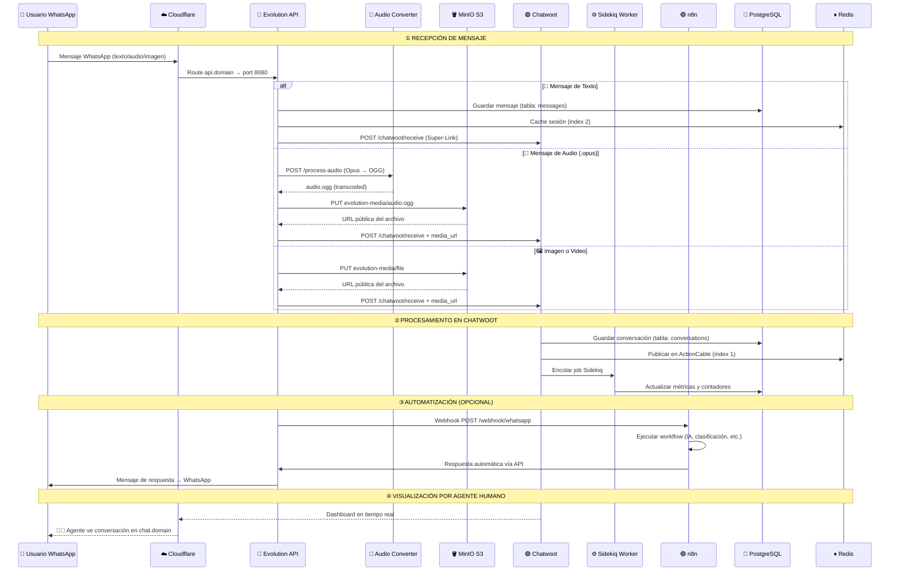

# 🏛️ Flujo Arquitectónico | Sentinel OS v11.0

> *Topología de datos, caminos de información y puntos de sincronización*
>
> *"La arquitectura de un sistema define los límites de su inteligencia."*

---

## 📐 Modelo Formal de la Arquitectura

El flujo de información en Sentinel OS se modela como un **grafo dirigido acíclico** (DAG) con 3 capas funcionales:

```
L₃ = Capa de Acceso     = {Cloudflare Tunnel}
L₂ = Capa de Aplicación = {Evolution, Chatwoot, n8n, AudioConverter}
L₁ = Capa de Datos      = {PostgreSQL, Redis, MinIO}
```

**Regla de flujo**: La información siempre fluye `L₃ → L₂ → L₁` (entrada) y `L₁ → L₂ → L₃` (salida). Nunca hay comunicación directa entre capas no adyacentes.

---

## 🔄 Flujo Completo de un Mensaje WhatsApp



---

## 🧬 Puntos de Integración

### Super-Link: Evolution ↔ Chatwoot

El **Super-Link** es la conexión bidireccional entre Evolution API y Chatwoot CRM:

```
Evolution → Chatwoot (incoming):
  CHATWOOT_URL=http://chatwoot-web:3000   (DNS interno Docker)
  CHATWOOT_TOKEN=${CHATWOOT_GLOBAL_TOKEN}  (Bearer auth)
  CHATWOOT_ACCOUNT_ID=1

Chatwoot → Evolution (outgoing):
  Configurado en Chatwoot → Settings → Integrations → Channel: API
  El agente responde en Chatwoot → Chatwoot llama a Evolution → WhatsApp
```

**Variables críticas**:
- `CHATWOOT_URL` → URL **interna** (nunca la pública)
- `CHATWOOT_GLOBAL_TOKEN` → Se autogenera con `sistema_maestro.sh`
- Si alguna de estas falla, los mensajes llegan a Evolution pero NO aparecen en Chatwoot

### Webhooks: Evolution → n8n

```
Evolution envía webhooks a n8n cuando:
├── Nuevo mensaje recibido → messages.upsert
├── Mensaje actualizado → messages.update
├── QR code generado → qrcode.updated
├── Conexión establecida → connection.update
└── Presencia actualizada → presence.update

Configurar en Evolution API:
POST /webhook/set/{instance}
{
  "url": "https://n8n.tudominio.com/webhook/whatsapp",
  "webhook_by_events": true,
  "events": ["MESSAGES_UPSERT"]
}
```

---

## 💾 Mapa de Almacenamiento

```
┌─────────────────────────────────────────────────────┐
│                    MinIO S3                          │
│  ┌───────────────────┐  ┌───────────────────────┐   │
│  │ evolution-media    │  │ chatwoot-storage      │   │
│  │ (multimedia WA)    │  │ (adjuntos CRM)        │   │
│  │                    │  │                       │   │
│  │ • Imágenes         │  │ • Logos de inbox      │   │
│  │ • Videos           │  │ • Avatares de agentes │   │
│  │ • Audios (.ogg)    │  │ • Archivos adjuntos   │   │
│  │ • Documentos       │  │ • Capturas de QR      │   │
│  │ • Stickers         │  │                       │   │
│  └───────────────────┘  └───────────────────────┘   │
│  Política: download (público) — Acceso vía CDN      │
│  CDN URL: https://s3.tudominio.com                  │
└─────────────────────────────────────────────────────┘

┌─────────────────────────────────────────────────────┐
│                  PostgreSQL 16                       │
│  ┌──────────┐  ┌───────────┐  ┌──────────────────┐  │
│  │ chatwoot  │  │ evolution │  │       n8n        │  │
│  │           │  │           │  │                  │  │
│  │ ~200 tabs │  │ ~50 tabs  │  │ ~30 tabs         │  │
│  │ Users     │  │ Sessions  │  │ Workflows        │  │
│  │ Convos    │  │ Messages  │  │ Executions       │  │
│  │ Messages  │  │ Contacts  │  │ Credentials      │  │
│  │ Contacts  │  │ Webhooks  │  │ Webhooks         │  │
│  └──────────┘  └───────────┘  └──────────────────┘  │
│  Extensiones: pgcrypto, uuid-ossp en cada DB        │
└─────────────────────────────────────────────────────┘

┌─────────────────────────────────────────────────────┐
│                   Redis 7.4                          │
│  ┌──────────────────────────────────────────────┐   │
│  │ Index 1: Chatwoot                            │   │
│  │   • Sidekiq jobs (cola de background)        │   │
│  │   • ActionCable (WebSockets en tiempo real)  │   │
│  │   • Cache de vistas y fragmentos             │   │
│  ├──────────────────────────────────────────────┤   │
│  │ Index 2: Evolution                           │   │
│  │   • Cache de sesiones WhatsApp activas       │   │
│  │   • Estado de conexiones Baileys             │   │
│  │   • TTL: 604800s (7 días)                    │   │
│  └──────────────────────────────────────────────┘   │
└─────────────────────────────────────────────────────┘
```

---

## 🔒 Flujo de Seguridad

```
Internet → Cloudflare → [TLS Terminación] → Tunnel Cifrado → Docker Network → Servicio

Propiedades:
• Ningún puerto expuesto al internet desde el servidor
• TLS cifrado end-to-end por Cloudflare
• Red Docker aislada (secure-net): solo servicios se ven entre sí
• PostgreSQL: no tiene port binding, solo accesible internamente
• Redis: protegido con password + solo red interna
• MinIO: ports en 127.0.0.1 (solo localhost, no accesible desde afuera)
```

---

<div align="center">

**Flujo Arquitectónico v11.0** — *Topología de Datos y Sincronización*

Desarrollado con 🧬 por **[HackUN09](https://github.com/HackUN09)** & **Antigravity AI**

</div>
