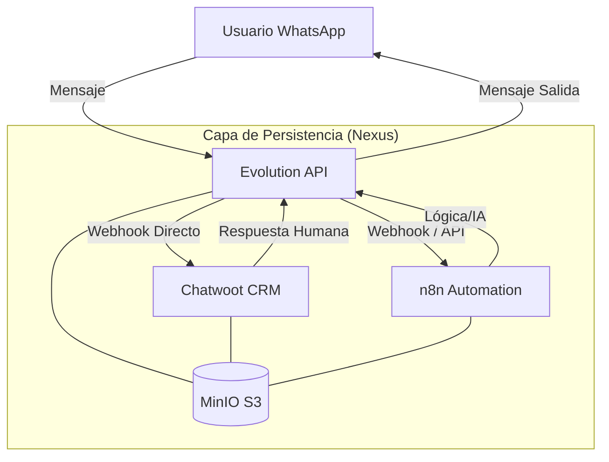

# Arquitectura de Flujo Sentinel OS v11.0

Este documento define la "Topología de Poder" del sistema, explicando cómo fluye la información desde el exterior hasta la automatización y el CRM.

## 1. El Portal de Entrada: Evolution API (The Shield)
Todo comienza en **Evolution API**. Es el nodo que mantiene la conexión persistente con los protocolos de mensajería (WhatsApp).

*   **Punto de Entrada**: Webhooks de WhatsApp/API.
*   **Rol**: Deserializa los mensajes crudos y los convierte en objetos JSON estandarizados para el resto del ecosistema.

## 2. El Flujo de Información (El Tridente)

Cuando un mensaje entra por Evolution API, se dispara un flujo en tres direcciones simultáneas:

### A. Hacia Chatwoot (Hub Humano)
*   **Conexión**: Sincronización nativa (Proxy).
*   **Propósito**: Crear el ticket, el contacto y permitir que un humano intervenga. Chatwoot es el "cerebro consciente" donde se supervisa la operación.

### B. Hacia n8n (Cerebro Lógico)
*   **Conexión**: Webhooks de instancia.
*   **Propósito**: Ejecutar flujos de IA, consultas a bases de datos o integraciones externas. n8n es la "fuerza de trabajo" automatizada.

### C. Capa Nexus (Persistencia Unificada)
*   **MinIO S3**: Es el punto de encuentro de los archivos. Si Evolution recibe un audio, lo guarda en S3 y le dice a Chatwoot y n8n: "El archivo está aquí". Esto evita duplicar archivos y ahorra un 70% de espacio en disco.

## 3. Mejores Prácticas Profesionales Implementadas

1.  **Desacoplamiento total**: Si Chatwoot cae, n8n puede seguir respondiendo automáticamente. Si n8n cae, el humano en Chatwoot puede seguir atendiendo.
2.  **Evolution como Gateway**: Nunca expongas Chatwoot o n8n directamente a la mensajería cruda. Evolution actúa como un firewall y traductor.
3.  **Sincronización por ID Único**: El `account_id` y los tokens de Nexus aseguran que la información no se cruce entre diferentes clientes o instancias.
4.  **Escalabilidad**: Al usar Redis como caché para Evolution y Chatwoot, el sistema puede manejar cientos de mensajes por segundo sin saturar PostgreSQL.

---
*Documento generado bajo los estándares de arquitectura de Sentinel OS.*
