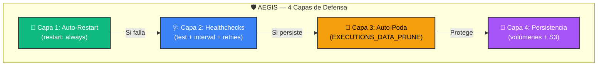

# 🛡️ Protocolo AEGIS | Sentinel OS v11.0

> *Arquitectura de Equilibrio Global con Inmunización Sistémica*
>
> *"Un sistema que no puede repararse a sí mismo no es un sistema — es un accidente esperando suceder."*

---

## 📐 Definición Formal

**AEGIS** (Autonomous Equilibrium Guardian & Immunization System) es el subsistema de autodefensa de Sentinel OS. Su función es mantener el **invariante de estabilidad**:

```
∀t ≥ 0 : Ψ(t) = ∏ᵢ₌₁⁸ Hᵢ(t) = 1

Donde:
  Ψ(t) = Estado global del sistema en el instante t
  Hᵢ(t) = Resultado del healthcheck del servicio i ∈ {0, 1}
  Si Ψ(t) = 0 → Se activa el Protocolo AEGIS
```

---

## 🧬 Las 4 Capas de Defensa



---

## 🔄 Capa 1: Auto-Restart (Resiliencia Instantánea)

**Principio**: Si un contenedor se detiene por cualquier razón (crash, OOM, excepción no manejada), Docker lo reinicia automáticamente.

**Implementación**: Todos los servicios tienen `restart: always` en su `docker-compose.yml`:

```yaml
services:
  chatwoot-web:
    restart: always    # ← Auto-restart incondicional
    deploy:
      resources:
        limits:
          memory: 2G   # ← OOM-killer lo mata si supera 2G → restart
```

**Tiempo de recuperación**: 5-15 segundos.

---

## 🩺 Capa 2: Healthchecks Activos (Diagnóstico Continuo)

Cada servicio tiene un **healthcheck** que Docker ejecuta periódicamente. Si falla `retries` veces consecutivas, Docker marca el servicio como `unhealthy` y lo reinicia.

| Servicio | Test | Intervalo | Retries |
|:---------|:-----|:---------:|:-------:|
| 🐘 PostgreSQL | `pg_isready -U root_admin` | 10s | 5 |
| ♦️ Redis | `redis-cli -a $PASS ping` | 10s | 5 |
| 🪣 MinIO | `curl -f http://localhost:9000/minio/health/live` | 30s | 3 |
| 🎤 Audio Converter | `wget -qO- http://localhost:4040` | 30s | 5 |

**Fórmula de detección de fallo**:
```
T_detección = interval × retries
PostgreSQL: 10s × 5 = 50 segundos máximo para detectar un fallo
MinIO:      30s × 3 = 90 segundos máximo
```

---

## 🧹 Capa 3: Auto-Poda (Prevención de Degradación)

**Problema que resuelve**: n8n almacena el registro de cada ejecución de workflow en PostgreSQL. Sin poda, la tabla `execution_entity` crece sin límite, degradando queries y llenando el disco.

**Solución**: El Protocolo AEGIS configura poda automática:

```bash
# Variables en .env [11]:
N8N_EXECUTIONS_DATA_MAX_AGE=168        # Máximo 7 días (168 horas)
N8N_EXECUTIONS_DATA_PRUNE=true         # Poda activa
N8N_EXECUTIONS_DATA_PRUNE_TIMEOUT=3600 # Timeout de 1 hora para el proceso
```

**Cálculo del impacto**:
```
Si un workflow se ejecuta 100 veces/hora:
  Sin poda: 100 × 24 × 365 = 876,000 registros/año → ~10 GB en DB
  Con AEGIS: 100 × 168 = 16,800 registros máximo → ~200 MB estable
```

---

## 💾 Capa 4: Persistencia Garantizada (Datos Inmutables)

Todos los datos críticos del sistema están montados como **volúmenes Docker** en el directorio `persistence/`:

```
persistence/
├── postgres/     # Datos de las 3 bases de datos
├── redis/        # AOF (Append-Only File) para durabilidad
├── minio/        # Archivos multimedia (imágenes, audios, videos)
├── n8n/          # Workflows, credenciales cifradas
└── evolution/    # Instancias Wi, sesiones WhatsApp
    ├── instances/
    └── store/
```

**Garantía**: Incluso si haces `docker compose down` y `docker compose up`, todos los datos persisten. Solo se pierden si borras el directorio `persistence/` manualmente.

**Backup completo**:
```bash
# Crear backup comprimido
tar -czf sentinel-backup-$(date +%Y%m%d).tar.gz persistence/

# Restaurar backup
tar -xzf sentinel-backup-YYYYMMDD.tar.gz
```

---

## 🎤 Capa Especial: Heal Media (Auto-Curado de Multimedia)

El **Sentinel Engine** incluye una función especial `heal_media()` que corrige automáticamente los metadatos S3 de archivos multimedia:

**Problema original**: WhatsApp envía audio como `.opus` con MIME type `audio/opus` y disposición `attachment`. Los navegadores no reproducen inline este formato.

**Solución automática** (se ejecuta tras `--setup-s3`):

```python
# Pseudocódigo de heal_media():
for each object in bucket "chatwoot-storage":
    if extension == ".opus":
        set Content-Type = "audio/ogg"        # Compatible con todos los browsers
        set Content-Disposition = "inline"     # Reproducir en vez de descargar
    if extension in [".mp4", ".webm", ".mov"]:
        set Content-Disposition = "inline"     # Videos se reproducen en línea
```

**Ejecutar manualmente**:
```bash
python ops/scripts/sentinel_engine.py --heal-media
```

---

## 📊 Dashboard de Salud

```bash
# Comando rápido para verificar el estado AEGIS:
docker ps --format "table {{.Names}}\t{{.Status}}" | sort

# Resultado esperado:
# NAMES                       STATUS
# app_evolution               Up 2 hours
# app_n8n_editor              Up 2 hours
# cache_core                  Up 2 hours (healthy)
# chatwoot-web                Up 2 hours
# chatwoot-worker             Up 2 hours
# cloudflared_tunnel          Up 2 hours
# core_minio                  Up 2 hours (healthy)
# db_core                     Up 2 hours (healthy)
# evolution_audio_converter   Up 2 hours (healthy)
```

Si algún servicio dice `Restarting` o `Exited`, AEGIS lo está reparando automáticamente. Espera 30 segundos y vuelve a verificar.

---

<div align="center">

**Protocolo AEGIS v11.0** — *Autonomous Equilibrium Guardian & Immunization System*

Desarrollado con 🧬 por **[HackUN09](https://github.com/HackUN09)** & **Antigravity AI**

</div>
